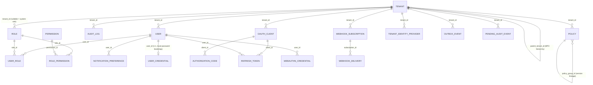

# AGNO WFM — Module 01: Platform Core, Multi-Tenancy & Identity Platform

**All 7 phases of the source spec are complete.** Phase 1 (Schema &
Migrations) — see `docs/phase-1-design-doc.md` and ADR-0001–0007. Phase 2
(Identity Core: OAuth2.1/OIDC/PKCE, JWT issuance + rotation,
`IdentityService` gRPC) — see `docs/phase-2-design-doc.md` and
ADR-0023–0028. Phase 3 (Enterprise SSO: SAML 2.0, per-tenant IdP config,
SCIM 2.0, WebAuthn/Passkeys) — see `docs/phase-3-design-doc.md` and
ADR-0029–0034. Phase 4 (RBAC/ABAC enforcement + Policy engine API) — see
`docs/phase-4-design-doc.md` and ADR-0035–0038. Phase 5 (Audit event
publishing, `AuditService.RecordEvent`, plus a follow-up closing its
initial durability/instrumentation/provisioning gaps) — see
`docs/phase-5-design-doc.md` and ADR-0039–0044. Phase 6 (`/v1/tenants`, a
read-only GraphQL BFF, webhooks, `Idempotency-Key`, an Envoy gateway) —
see `docs/phase-6-design-doc.md` and ADR-0045–0048. Phase 7 (observability
— tracing/metrics/health checks/an SLO dashboard, chaos/game-day exercises,
an incident postmortem template, CI hardening, and a security fix closing
a cross-tenant header-forgery bypass in `TenantContextMiddleware`) — see
`docs/phase-7-design-doc.md` and ADR-0049–0051.

## What's in Phase 1 (schema & tenant isolation)

- Full DDL for every entity in §2 of the module spec (`Tenant`, `User`,
  `Role`, `Permission`, `RolePermission`, `UserRole`, `Policy`, `AuditLog`,
  `NotificationPreference`) — `src/database/migrations/1700000000000-InitialSchema.ts`.
- Row Level Security on every tenant-scoped table, plus an
  application-layer guard (`TenantScopedRepository` /
  `TenantContextService`) that fails closed if no tenant context is bound —
  see ADR-0002.
- Two Postgres roles (`agno_migrator`, `agno_app`) so `audit_log`'s
  append-only requirement is a `GRANT` fact, not an application promise.
- A CI-enforced check (`npm run migration:lint`) that RLS is enabled and
  every composite index is `tenant_id`-first, across the whole schema —
  a database-fact check, not a code-review convention.

## What's in Phase 2 (identity core)

- `POST /oauth/authorize` (ADR-0026's API-first simplification — no hosted
  login UI in this repo), `POST /oauth/token` (authorization_code+PKCE,
  refresh_token rotation, client_credentials), `POST /oauth/revoke`,
  `POST /oauth/introspect`, `POST /oauth/register` — `src/modules/auth`.
- `GET /.well-known/openid-configuration`, `GET /.well-known/jwks.json`.
- RS256-signed JWT access tokens matching §3.4's claim shape exactly, OIDC ID
  tokens, and refresh token rotation with family-based reuse detection
  (ADR-0025) — Postgres is the source of truth, Redis is a fast-path cache
  only (§1), never system of record.
- `IdentityService.ValidateToken`/`GetUserContext` gRPC (`src/grpc/proto/identity.proto`,
  `IdentityGrpcController`), backed by a 60-second Redis cache-aside over a
  Postgres roles/permissions join (`UserContextResolverService`).
- Local password authentication (ADR-0023) as a Phase 2 bootstrap, coexisting
  with (not replacing) Phase 3's SSO federation.
- Five new tables, all RLS-protected the same way Phase 1's tables are,
  except `oauth_clients` (ADR-0028's deliberate read-open/write-gated
  variant — a client_id lookup has to work before any tenant context is
  known) and `signing_keys` (global reference data, no RLS, like `Permission`).

## What's in Phase 3 (enterprise SSO, SCIM, WebAuthn)

- Per-tenant `TenantIdentityProvider` config (SAML 2.0 + generic OIDC — one
  code path covers Entra ID/Okta/Auth0/Keycloak/Ping/OneLogin/Google
  Workspace/GitHub Enterprise/GitLab/Apple, per-tenant config only, no
  per-vendor code), admin CRUD at `/v1/identity-providers` — `src/modules/sso`.
- `GET /v1/auth/sso/login/:tenantIdpId` (real browser redirect to the IdP)
  and the shared `GET`/`POST /v1/auth/sso/callback` dispatcher (ADR-0031) —
  a successful federated login issues this platform's own authorization
  code through the same path Phase 2's password login uses, so `/oauth/token`
  onward is identical either way.
- SCIM 2.0 `/scim/v2/Users` + `/scim/v2/Groups` (RFC 7644) — `src/modules/scim`.
  Groups map onto tenant-scoped `Role`/`UserRole` (ADR-0032). Deprovisioning
  a user (`PATCH .../active:false` or `DELETE`) force-revokes every active
  session for that user, per §5.7.
- WebAuthn/Passkeys (`src/modules/webauthn`, `@simplewebauthn/server`):
  registration (requires an existing access token) and authentication
  (public, tenant-resolved via `client_id`) ceremonies, bridged into
  `POST /oauth/authorize` as an alternate credential alongside password
  (ADR-0033).
- Per-tenant auth-method policy (`PolicyType.AUTH_METHOD_POLICY`) reusing
  Phase 1's JSONB `Policy.definition` mechanism — no new table needed to add
  a new policy-governed concern, exactly what that mechanism was built for.
- Two new tables (`tenant_identity_providers` — read-open/write-gated RLS,
  ADR-0029, same shape as `oauth_clients`; `webauthn_credentials` — standard
  closed tenant isolation) plus two new nullable columns on `core.users`
  (`given_name`, `family_name`) SCIM's core schema needs.

## What's in Phase 4 (RBAC/ABAC enforcement, Policy engine API)

- `PermissionsGuard` + `@RequirePermissions(...)` — RBAC enforcement reading
  §3.4's JWT `permissions` claim, applied to `/v1/roles`, `/v1/permissions`,
  `/v1/users/{id}/roles`, `/v1/policies`, and (retroactively) Phase 3's
  `/v1/identity-providers` — `src/modules/auth/rest`.
- `AbacService` — fresh-lookup, exact-org-unit-match ABAC enforcement
  (ADR-0035, ADR-0036), gating org-unit-scoped `Policy` writes.
- `POST /v1/policies` (create/version) + `GET /v1/policies/{policyId}/history` —
  §3.2's explicitly-named endpoints, backed by an atomic version-supersede
  transaction — `src/modules/policy`, `PolicyApiModule`.
- `PolicyService.GetActivePolicy` gRPC (§3.3) — resolves the policy active
  as of an arbitrary timestamp, tenant-wide or org-unit-scoped.
- Role/Permission/UserRole management REST API
  (`/v1/roles`, `/v1/permissions`, `/v1/users/{id}/roles`) —
  `src/modules/identity`, `IdentityApiModule`.
- `UserContextCacheService` invalidation wired into every RBAC mutation
  that can change a live user's effective permissions (ADR-0038).
- No new tables this phase — every entity Phase 4 enforces against
  (`Role`, `Permission`, `RolePermission`, `UserRole`, `Policy`) was already
  built in Phase 1; this phase is enforcement + API, not schema.

## What's in Phase 5 (audit + AI rationale enforcement)

- `core.outbox_events` transactional outbox (ADR-0039) — `AuditLogRepository.record`
  and `PoliciesRepository.createLineage`/`.supersede` each write their domain
  row and an `AuditEvent`/`PolicyChanged` outbox row in the same transaction,
  drained by `CoreOutboxPublisherService` on a 10-second schedule with
  retry-then-DLQ (`agno.core.dlq.v1`) — `src/modules/core-eventing`.
- `AuditService.RecordEvent` gRPC (§3.3) — `src/grpc/proto/audit.proto`,
  `AuditGrpcController`. `AuditEventBatcherService` validates the §2.2 rule 3
  `ai_rationale` requirement synchronously (so a caller gets an immediate,
  correct rejection) and batches accepted events for a 2-second, per-tenant
  flush — true fire-and-forget from the caller's side (ADR-0040).
- `GET /v1/audit-log` (§3.2, named explicitly) — cursor-based pagination on
  `created_at`, filterable by `actorType`/`resourceType`/`resourceId`/date
  range — `src/modules/audit/rest`.
- Audit instrumentation (ADR-0041, extended by ADR-0044): every mutation on
  `RoleManagementController`, `PolicyManagementController.create`,
  `OAuthController` (token issuance/refresh/revocation, client
  registration), `SsoController` (successful federated login),
  `TenantIdentityProvidersController` (IdP config CRUD),
  `ScimUsersController`/`ScimGroupsController` (user/group provisioning),
  and `WebAuthnController` (credential registration/deletion, successful
  passkey authentication) now records an `audit_log` entry. `AuditModule`
  was split into a lightweight `AuditModule` + `AuditApiModule`
  composition root (ADR-0044) so `AuthModule`/`SsoModule`/`ScimModule`/
  `WebAuthnModule` can depend on it without a DI cycle.
- `core.pending_audit_events` (ADR-0042): a Postgres-backed durable queue
  behind `AuditEventBatcherService`, replacing what was originally a plain
  in-memory array — `enqueue` durably inserts a row before returning, and
  the 2-second flush tick reads/deletes from this table, so a process
  restart between the two no longer loses anything.
  `AuditEventBatcherService` also implements `OnModuleDestroy` (best-effort
  final flush on a graceful shutdown, paired with `main.ts`'s
  `app.enableShutdownHooks()`).
- `npm run nats:provision-streams` (ADR-0043): idempotently provisions the
  JetStream streams (`AGNO_CORE_AUDIT`/`AGNO_CORE_POLICY`/`AGNO_CORE_DLQ`/
  `AGNO_ORG_EVENTS`/`AGNO_ORG_DLQ`) every `NatsClientService.publish` call
  assumes already exist, with explicit retention (`scripts/provision-nats-streams.ts`)
  — a standalone script, the same shape as `npm run migration:run`, not
  something app boot runs automatically.
- Two new tables: `core.outbox_events` (ADR-0039), structurally mirroring
  Module 02's `org.outbox_events` but kept separate and independently
  published, and `core.pending_audit_events` (ADR-0042), the durable queue
  above.

## What's in Phase 6 (GraphQL BFF, webhooks, Idempotency-Key, Envoy gateway)

- `/v1/tenants` (`TenantManagementController`, `TenantApiModule`) — `self`/
  `:id`/list-children/create/update over `TenantsRepository` (existed since
  Phase 1, had no REST surface until now), RBAC-gated
  (`tenant:read`/`tenant:write`), audit-instrumented.
- Read-only GraphQL BFF (`PlatformGraphQLModule`, ADR-0045) —
  `tenant`/`myTenant`/`tenantChildren`, `me`/`user`/`users` (+ `roles`
  field), `role`/`roles`/`permissions` (+ `permissions` field),
  `policy`/`policyHistory`/`policies`, `auditLog` — every query delegates to
  the same service/repository its REST equivalent already uses.
  `AccessTokenGuard`/`PermissionsGuard` are now GraphQL-aware
  (`GqlExecutionContext`), so both surfaces enforce RBAC identically. No
  GraphQL mutations this phase — REST remains the only write path (ADR-0045).
- Webhook subscriptions (`/v1/webhooks`, `WebhookApiModule`) — admin CRUD,
  signing secret returned once at creation, plus a durable delivery queue
  (`core.webhook_deliveries`, HMAC-SHA256 signed `t=<ts>,v1=<hmac>`,
  retry-then-dead-letter) fed from `CoreOutboxPublisherService`'s existing
  drain loop rather than a second independent poll (ADR-0046).
- `Idempotency-Key` support (`IdempotencyInterceptor`, global, opt-in,
  Redis-backed cache-replay + atomic in-flight lock) for REST
  POST/PUT/PATCH/DELETE (ADR-0047).
- Envoy gateway config (`envoy/envoy.yaml`, docker-compose `envoy` service)
  — REST/GraphQL (8080) and gRPC (8081) listeners, a coarse
  `local_ratelimit` safety net. Per-tenant `PolicyType.RATE_LIMIT`-driven
  quota enforcement (§3.4) needs an external Envoy Rate Limit Service not
  built this phase — the policy data model and CRUD already work today,
  only enforcement is deferred (ADR-0048).
- Two new tables: `core.webhook_subscriptions` (standard closed tenant
  isolation) and `core.webhook_deliveries` (cross-tenant-batch-read RLS,
  same shape as `core.outbox_events`/`core.pending_audit_events`).

## What's in Phase 7 (observability & hardening)

- **`TenantContextMiddleware` JWT-derived tenant context** (ADR-0049) — a
  security fix, not just new observability surface: closes a real
  cross-tenant bypass where a valid access token for tenant A plus a
  forged `X-Tenant-Id` header could execute RBAC-gated requests against
  tenant B's RLS context. Tenant context now comes from the JWT's own
  claims whenever a valid `Authorization: Bearer` token is present;
  `X-Tenant-Id`/`X-Platform-Admin` headers are only trusted in their
  absence (ADR-0014's original placeholder, now scoped down).
- OpenTelemetry tracing (`src/tracing.ts`) — auto-instrumented HTTP/
  Express/pg/ioredis, imported first in `main.ts` (before anything OTel
  needs to patch), fail-open with no OTLP collector configured.
- `GET /metrics` (Prometheus) — HTTP/GraphQL/**and gRPC** request
  duration + count (`HttpMetricsInterceptor`, a global interceptor that
  understands all three of this app's transports — a real bug caught and
  fixed during this phase's own testing, since a naive HTTP-only
  interceptor throws on a gRPC `ExecutionContext`), plus three
  durable-queue-depth gauges (`core_outbox_events_unpublished`,
  `core_pending_audit_events`, `core_webhook_deliveries_pending`).
- `GET /healthz` (liveness, no dependency checks) / `GET /readyz`
  (readiness — Postgres-gated, Redis reported but not gating, per §1's
  fail-open posture).
- `observability/grafana-dashboard.json` — an SLO dashboard mapped
  directly to §0.5's own named targets (IdentityService gRPC p99 latency
  vs. 50ms, IdentityService gRPC availability vs. 99.95%, SSO callback
  success rate vs. 99.9%), auto-provisioned by new docker-compose
  `prometheus`/`grafana` services.
- A chaos/game-day runbook section (six concrete failure-injection
  scenarios, each naming the already-engineered degraded-mode behavior a
  game day should verify) and a fillable incident postmortem template,
  replacing `docs/runbook.md`'s one-line Phase 7 placeholder.
- CI hardening (ADR-0051): a CodeQL SAST workflow
  (`.github/workflows/codeql.yml`), an `npm audit --audit-level=critical`
  blocking gate + `--audit-level=high` informational report, and CycloneDX
  SBOM generation uploaded as a build artifact on every run.
- No new tables this phase — every gauge reads from tables built in
  earlier phases (`core.outbox_events`, `core.pending_audit_events`,
  `core.webhook_deliveries`); each of those three repositories gained one
  additive `count`-style method.

## Entity relationships



`SigningKey` isn't in this diagram — it's global platform reference data (no
`tenant_id`, like `Permission`), not tenant-scoped domain data. A SCIM Group
also isn't in this diagram — it isn't a table, it's a view over the
already-modeled `Role`/`UserRole` (ADR-0032). `core.outbox_events` and
`core.pending_audit_events` are both shown only as a `tenant_id` fan-out, not
linked to `AUDIT_LOG`/`POLICY` by FK — both are operational relay/queue
tables (their payload columns are JSONB snapshots, not foreign keys),
written and deleted independently of the rows that triggered them.
`core.webhook_deliveries` *does* carry a real FK to its subscription
(unlike the outbox/pending-audit tables) since a delivery is meaningless
without knowing which subscription it's for.

## Getting started

```bash
docker-compose up -d           # Postgres 16 + agno_migrator/agno_app roles, Redis 7
cp .env.example .env
npm ci
npm run migration:run          # applies src/database/migrations
npm run migration:lint         # verifies RLS + index ordering (§2.2 rule 1)
npm run nats:provision-streams # idempotently provisions JetStream streams (ADR-0043) - run once per environment
npm run seed                   # optional local-dev fixtures (incl. a demo OAuth client + password)
npm run test                   # unit tests, no DB/Redis required
npm run test:integration       # requires the steps above
npm run start:dev              # REST /oauth/*, /v1/auth/sso/*, /webauthn/*, /scim/v2/*, /v1/policies, /v1/roles, /v1/audit-log, /v1/tenants, /v1/webhooks, /healthz, /readyz, /metrics, /.well-known/*, GraphQL /graphql, gRPC :5000
docker-compose up -d envoy     # optional - fronts the app on :8080 (REST/GraphQL) / :8081 (gRPC), see envoy/envoy.yaml
docker-compose up -d prometheus grafana  # optional - SLO dashboard at http://localhost:3001 (admin/admin), see observability/
OTEL_EXPORTER_OTLP_ENDPOINT=http://localhost:4318 npm run start:dev  # optional - ships traces to a local OTLP collector
```

## Scripts

| Script | What it does |
|---|---|
| `npm run migration:run` / `:revert` | Apply / roll back migrations, using `agno_migrator` credentials (`src/database/data-source.ts`). |
| `npm run migration:lint` | CI gate: RLS enabled + `tenant_id`-first composite indexes on every tenant-scoped table (`src/database/migration-lint.ts`). |
| `npm run nats:provision-streams` | Idempotently provisions the JetStream streams every `NatsClientService.publish` call needs, with explicit retention (`scripts/provision-nats-streams.ts`, ADR-0043). |
| `npm run seed` | Idempotent local-dev fixtures (`src/database/seeds/run-seed.ts`). |
| `npm run test` / `npm run test:integration` | Unit vs. integration Jest suites (`test/jest-unit.json`, `test/jest-integration.json`). |
| `npm run build` / `npm run start:dev` | Standard Nest build/dev bootstrap (`src/main.ts` — no routes mounted yet, see below). |

## Capacity planning (provisional — §0.5)

No load test exists yet (see the readiness checklists), so treat these as
sizing assumptions to validate once Phase 6 gives the module a real
end-to-end path to point load at, not as load-tested SLOs:

- **`audit_log` write volume**: assuming ~100k active users platform-wide
  and ~5 audit-worthy actions/user/day → ~500k rows/day, ~15M rows/month.
  Monthly partitioning (ADR-0005) keeps each partition + its indexes in the
  tens-of-millions-of-rows range, not billions, before rotation/retention
  (`policy_type = data_retention`) trims old partitions.
- **Connection pooling**: the app connects as `agno_app` through PgBouncer
  in real deployments (transaction pooling mode, since `TenantScopedRepository`
  holds a transaction only for the duration of one request-scoped unit of
  work, not across a session) - not modeled in `docker-compose.yml`, which is
  a direct single-instance Postgres for local dev only.
- **`IdentityService.ValidateToken`/`GetUserContext` (§0.5's stated
  p99 < 50ms, 99.95% availability targets)**: now has a real implementation
  to measure, but no load test has been run against it yet. The 60-second
  `UserContextCacheService` TTL and Redis-fast-path refresh-token lookup are
  sized by reasoning about request patterns (one `GetUserContext` call per
  downstream request, per §3.3), not benchmarked.
- **Redis sizing**: not capacity-planned yet - `docker-compose.yml`'s single
  local-dev instance has no memory limit or eviction policy configured; a
  production deployment needs both (§0.5's FinOps guardrail) before this is
  a sizing claim, not just a working local setup.
- **SSO callback success rate (§0.5's stated >= 99.9% target)**: has a real
  implementation to measure against now (Phase 3), but no measurement has
  been taken - this depends heavily on external IdP availability, which
  this platform doesn't control.
- **`OidcFederationService`'s per-instance discovery-document cache** (1h
  TTL, ADR-0030) isn't shared across horizontally scaled replicas - fine at
  small scale, worth moving to a shared cache if per-replica discovery
  fetches become a measured hot path.
- **`AbacService`'s per-request join** (Phase 4): reasoned to be cheap
  (indexed FKs, small per-tenant role-assignment counts) but not measured
  under load.
- **The outbox/NATS pipeline** (Phase 5): `CoreOutboxPublisherService`'s
  10-second drain and `AuditEventBatcherService`'s 2-second flush are sized
  by reasoning about the same ~500k rows/day assumption above, not by
  measurement — no live NATS broker was available to load-test against
  (see the Phase 5 readiness checklist). `npm run nats:provision-streams`'s
  retention/byte-cap numbers (ADR-0043) are the same kind of reasoned-not-
  measured default.
- **The GraphQL BFF and webhook delivery dispatcher** (Phase 6): no load
  test exists for either. `WebhookDeliveryDispatcherService`'s 5-second
  tick and `IdempotencyInterceptor`'s 24h Redis TTL are reasoned defaults,
  not benchmarked. Envoy's `local_ratelimit` (200 req/s, ADR-0048) is a
  round-number safety net, not derived from any measured traffic pattern -
  real per-tenant quotas need the external Rate Limit Service this phase
  didn't build.
- **Every §0.5 SLO target above now has a dashboard panel to actually
  measure it against** (Phase 7, `observability/grafana-dashboard.json`) —
  but no live Prometheus/Grafana/OTLP collector was available in this
  environment to confirm a panel renders correctly against real scraped
  data, and no load has been generated to populate one meaningfully even
  if it were. The dashboard is the *instrument*, not yet a *measurement*.

## Testing strategy

- **Unit** (`test/unit/`): `TenantContextService` (Phase 1); password
  hashing, PKCE challenge/verify/format-validation, signing key
  bootstrap/rotation/grace-window, JWT issue/verify/tamper/expiry (Phase 2);
  SCIM filter parsing, SCIM PATCH operation merging (incl. the forced-
  revocation trigger), WebAuthn/SSO Redis session bridges, auth-method
  policy evaluation (Phase 3); `PermissionsGuard`'s allow/deny/missing-
  claims paths, `RoleManagementService`'s validation logic (Phase 4);
  `AuditEventBatcherService`'s synchronous `ai_rationale` rejection, batch-
  by-tenant grouping, retry-in-place on flush failure, DLQ routing once
  retries are exhausted, and `onModuleDestroy`'s best-effort final flush
  (Phase 5, updated for the durable-queue redesign, ADR-0042);
  `WebhookDeliveryDispatcherService`'s HMAC signing/2xx-success/retry/
  dead-letter logic against a mocked `fetch`, and `IdempotencyInterceptor`'s
  cache-replay/concurrent-lock-rejection/pass-through paths against a
  mocked `RedisService` (Phase 6); `TenantContextMiddleware`'s JWT-vs-header
  precedence, including the exact forged-header cross-tenant attack
  scenario ADR-0049 closes; `HttpMetricsInterceptor`'s route-label
  resolution across HTTP/GraphQL/gRPC contexts (the gRPC-context handling
  is itself a regression test for a bug this phase's own testing caught);
  `HealthController`'s liveness/readiness logic, including that a down
  Redis is reported but does not fail readiness (Phase 7). No database or
  Redis required.
- **Integration** (`test/integration/`): against a real Postgres (+ Redis
  from Phase 2 on) with migrations applied — proves tenant isolation holds
  at both layers (`TenantScopedRepository` *and* raw RLS with the guard
  bypassed entirely) for every tenant-scoped table across all four phases,
  proves `audit_log` rejects `UPDATE` at the grant level, proves the
  `ai_rationale` `CHECK` constraint holds independently of the
  application-layer guard, exercises the full authorization_code+PKCE →
  token → refresh-rotation → reuse-detection flow end to end, exercises a
  full SCIM create → deprovision → forced-session-revocation flow plus SCIM
  Group membership add/remove, exercises the RBAC-vs-ABAC scoping
  distinction plus a full policy lineage versioning transaction, and (Phase 5)
  proves `AuditLogRepository.record`/`PoliciesRepository.createLineage`/
  `.supersede` write their domain row and outbox row atomically (including
  that a rejected `ai_agent` audit write produces neither row), and proves
  `core.pending_audit_events` is genuinely durable — a row enqueued by one
  `PendingAuditEventsRepository` instance is correctly found and processed
  by a second, independently-constructed `AuditEventBatcherService`
  instance, simulating a process restart between `enqueue` and the next
  flush tick (ADR-0042); and (Phase 6) proves `WebhookFanoutService.fanOut`
  enqueues a `core.webhook_deliveries` row for every active subscription
  matching an event's subject (and none for a non-matching subject or an
  inactive subscription), visible to the cross-tenant dispatcher batch read.
- **Not yet applicable**: contract tests for the GraphQL BFF/`/v1/tenants`/
  `/v1/webhooks` (the resolvers/controllers are thin glue over already-
  tested services/repositories - same "TypeScript's own structural checks
  cover the wiring" posture `auth-oauth-flow.spec.ts` states explicitly, not
  a gap unique to Phase 6), gRPC contract tests for `IdentityService`
  specifically in the style of `test/integration/grpc-employee-calendar.spec.ts`
  (a natural near-term addition, not yet written), end-to-end SAML/OIDC
  federation tests against a real or mock IdP (the service-layer logic is
  tested; a live IdP round trip is not), end-to-end delivery to a live
  JetStream broker or a real webhook receiver (both outbox *writes* and
  webhook *enqueue* are integration-tested; actual delivery to a live
  broker/receiver is not), a smoke test that actually runs Envoy against
  `envoy/envoy.yaml` or Prometheus/Grafana against
  `observability/prometheus.yml`/`grafana-dashboard.json` (Phase 7 - both
  are believed correct but unexercised against live instances), load tests
  (see Capacity planning above), E2E (no end-to-end user flow exists yet).

## Documentation index

- `docs/phase-1-design-doc.md`, `docs/phase-2-design-doc.md`,
  `docs/phase-3-design-doc.md`, `docs/phase-4-design-doc.md`,
  `docs/phase-5-design-doc.md`, `docs/phase-6-design-doc.md`,
  `docs/phase-7-design-doc.md` — problem, options, decision, blast radius,
  rollback, explicit assumptions, per phase.
- `docs/adr/0001`–`0007` — Phase 1: ORM choice, tenant isolation enforcement,
  enum representation, denormalized `tenant_id`, `audit_log` partitioning,
  policy versioning, `tenants` table RLS model.
- `docs/adr/0023`–`0028` — Phase 2: password bootstrap vs. SSO, signing key
  storage/rotation, refresh token reuse detection, the `/oauth/authorize`
  API-first simplification, PKCE S256-only enforcement, `oauth_clients`'
  read-open/write-gated RLS.
- `docs/adr/0029`–`0034` — Phase 3: `tenant_identity_providers`' RLS, SAML/
  OIDC library choices, the SSO federation state bridge, SCIM Group<->Role
  mapping, the WebAuthn session bridge, and explicit Phase 3 scope
  deferrals (LDAP/AD, SCIM Bulk/Schemas, per-vendor OIDC quirks, SSO logout).
- `docs/adr/0035`–`0038` — Phase 4: the RBAC-vs-ABAC enforcement split, why
  ABAC is exact-org-unit-match not subtree-aware, the composition-module
  pattern that avoids an `AuthModule`<->`PolicyModule`/`IdentityModule`
  cycle, and `UserContextCacheService` invalidation wiring.
- `docs/adr/0039`–`0044` — Phase 5: why `core.outbox_events` is separate from
  Module 02's `org.outbox_events` (and `NatsClientService` duplicated rather
  than shared), the `AuditService.RecordEvent` batching/retry/DLQ design,
  the initial scope decision to instrument only Policy CRUD and RBAC
  mutations, and the follow-up that closed that phase's remaining gaps: the
  `core.pending_audit_events` durable queue + graceful shutdown (0042),
  JetStream stream provisioning (0043), and OAuth/SSO/SCIM/WebAuthn audit
  instrumentation plus the `AuditModule`/`AuditApiModule` split (0044).
- `docs/adr/0045`–`0048` — Phase 6: why the GraphQL BFF is read-only this
  phase (0045), the webhook delivery durable-queue/signing design (0046),
  the `Idempotency-Key` interceptor's scope/failure-mode trade-offs (0047),
  and the Envoy gateway's routing + deliberately-coarse rate-limiting scope
  (0048).
- `docs/adr/0049`–`0051` — Phase 7: the `TenantContextMiddleware` JWT-derived
  tenant-context security fix and the cross-tenant bypass it closes (0049),
  the tracing/metrics/health-check design and why every piece of it fails
  open (0050), and the CI dependency-vulnerability gate's `critical`-only
  scope plus the SAST/SBOM additions (0051).
- `docs/production-readiness-checklist.md`,
  `docs/phase-2-production-readiness-checklist.md`,
  `docs/phase-3-production-readiness-checklist.md`,
  `docs/phase-4-production-readiness-checklist.md`,
  `docs/phase-5-production-readiness-checklist.md`,
  `docs/phase-6-production-readiness-checklist.md`,
  `docs/phase-7-production-readiness-checklist.md` — what's done vs.
  genuinely out-of-scope infra/process work, per phase.
- `docs/runbook.md` — migrations, partition maintenance, seeding, verifying
  isolation after a schema change, Redis, signing key rotation, revoking a
  compromised session, diagnosing `invalid_grant`, onboarding a SAML/OIDC
  IdP, diagnosing SSO failures, SCIM deprovisioning troubleshooting,
  WebAuthn credential management, bootstrapping tenant RBAC, diagnosing
  RBAC/ABAC 403s, diagnosing a missing `AuditEvent`/`PolicyChanged` in NATS
  (incl. `npm run nats:provision-streams`), diagnosing an
  `AuditService.RecordEvent` gRPC call that returned `accepted: false`,
  diagnosing a missing/stuck row in `core.pending_audit_events`, diagnosing
  a webhook subscription that isn't receiving events, diagnosing a
  `409 Conflict` from `IdempotencyInterceptor`, an observability quick
  reference (`/healthz`/`/readyz`/`/metrics`/tracing), six chaos/game-day
  exercise scenarios, and a fillable incident postmortem template.
