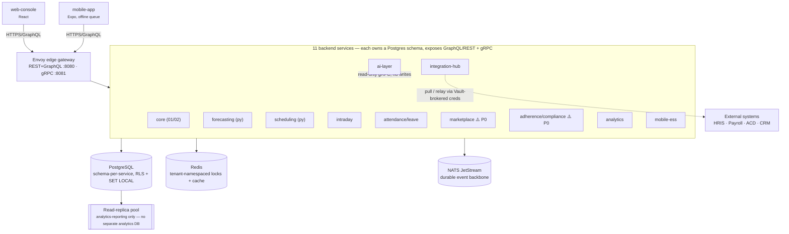
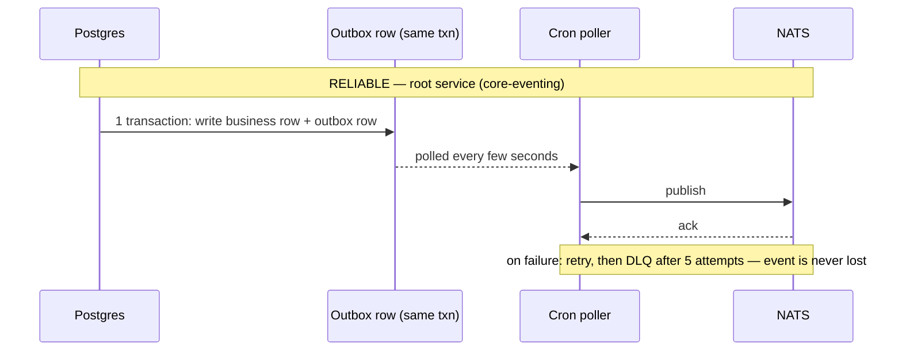
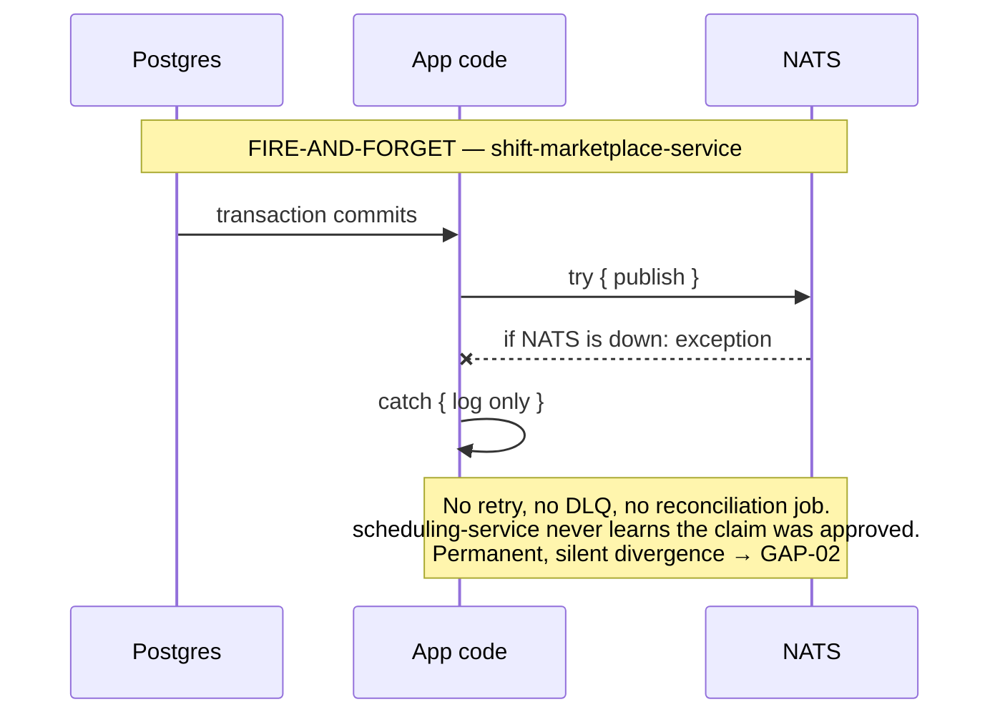

# Agno WFM — Enterprise Readiness Audit

**Repository:** `/Users/agnoshin/Projects/WFM`
**Audited:** 2026-08-18
**Scope:** 11 backend services + web-console + mobile-app
**Method:** Static, evidence-based code review — 9 parallel review passes across the repository's services, 56 database migrations, and the `docs/` design-doc/ADR trail
**Overall score:** **77 / 100 — Functional, with significant hardening required before enterprise production**

> The architecture is genuinely sophisticated — real RLS, real SCD Type 2 history, real CP-SAT scheduling constraints, a real transactional outbox — but four P0 defects (two of them in the platform's core value propositions: shift claiming and compliance reporting) must close before a 100k-employee customer goes live.

---

## Resolution status (as of 2026-08-18, same day)

The document below is preserved as the original point-in-time audit. Every P0 (GAP-01–04) and every P1 has since been fixed and verified against real Postgres/Redis/NATS infrastructure (not mocked), in the same session that produced this audit:

| ID | Status | Verification |
|---|---|---|
| GAP-01, GAP-02 | ✅ Fixed | shift-marketplace-service: partial unique index + claim-safe outbox from day one; 106/106 unit + integration tests |
| GAP-03 | ✅ Fixed | adherence-compliance-service: SUPERSEDED-aware resolution; 45/45 tests |
| GAP-04 | ✅ Fixed | `cost_center` added to `fn_employee_history_track()`'s change-detection |
| GAP-05 | ✅ Fixed | Real notification delivery engine (channel adapters + dispatcher), root service |
| GAP-06 | ✅ Fixed | Audit logging wired into employee/org-unit/skill/employee-skills/calendar/erasure-request/bulk-import mutations, verified end-to-end over real HTTP+GraphQL against real Postgres (`test/integration/employee-api-http.spec.ts`) |
| GAP-07 | ✅ Fixed | (1) `EmployeeSkillHistory`/`WorkingTimeCalendarHistory` SCD2 tables + triggers, same shape as the `org_unit`/`employee`/`policy` reference implementations; (2) backdated/future-dated support for employee and org-unit writes via a session-scoped `app.effective_at` GUC (`1700000017000`) — both verified against real Postgres, including a genuine `now()`-is-transaction-scoped edge case caught and fixed during verification |
| GAP-08 | ✅ Fixed | Real JWT verification (RS256, JWKS) on forecasting-service and scheduling-service, replacing raw-header trust; ~90 tests across both services |
| GAP-09 | ✅ Fixed | `EXCLUDE USING gist` constraint on `leave_request`, 149/149 tests |
| GAP-10 | ✅ Fixed | Pessimistic row lock on reallocation approval, 190/190 tests |
| GAP-11 | ✅ Documented | Divergent formulas cross-referenced in both services' doc comments (no consumer of Module 05's numbers exists yet) |
| GAP-12, GAP-13 | ✅ Fixed | integration-hub-service: real mTLS via undici `Agent`, pagination on both Workday and ADP connectors, 68/68 tests |
| GAP-14 | ✅ Fixed | `FOR UPDATE SKIP LOCKED` on all 3 outbox/durable-queue readers — this also surfaced and fixed a real TypeORM `UPDATE ... RETURNING` tuple-shape bug affecting 6+ call sites platform-wide |
| GAP-15 | ✅ Fixed | CI now runs lint/typecheck/migrate/test for all 11 backend services (was 4) |
| GAP-16 | ✅ Fixed | Real RLS-isolation integration tests added for all 10 non-root services (2 already had them; 8 built this session) — this work also caught and fixed a genuine P0 in mobile-ess-service (RLS silently rejected every write because the app never bound `app.current_tenant_id`) |

Two known pre-existing issues outside this audit's original scope, found incidentally while verifying the above and left unfixed (not part of any GAP-01–16 finding): a `userId`↔`Employee` linking test (`test/integration/employee-api-http.spec.ts`, ADR-0150/ADR-0157 territory) fails with a `fk_employees_tenant_user` FK violation; a stale `X-Tenant-Id`-only integration-test file (`org-api-http.spec.ts`, `skill-api-http.spec.ts`) predates the JWT-guard rollout and fails outright against the now-guarded resolvers — both confirmed via git-stash A/B testing to predate this session's changes.

---

## Table of contents

1. [Executive summary](#1-executive-summary)
2. [Architecture as built](#2-architecture-as-built)
3. [12-module scorecard](#3-12-module-scorecard)
4. [Cross-cutting scorecard](#4-cross-cutting-scorecard)
5. [Critical gap report](#5-critical-gap-report)
6. [Temporal / SCD Type 2 audit](#6-temporal--scd-type-2-audit)
7. [Multi-tenancy security audit](#7-multi-tenancy-security-audit)
8. [Concurrency audit](#8-concurrency-audit)
9. [Event architecture audit](#9-event-architecture-audit)
10. [Source-of-truth matrix](#10-source-of-truth-matrix)
11. [Security threat model](#11-security-threat-model)
12. [Load & scale plan](#12-load--scale-plan)
13. [Test plan — what to write next](#13-test-plan--what-to-write-next)
14. [Implementation roadmap](#14-implementation-roadmap)
15. [The final question](#15-the-final-question)
16. [Methodology & limitations](#16-methodology--limitations)

---

## 1. Executive summary

Two pages, one question: can this platform safely take a Fortune-500 contract tomorrow? No — but it is closer than the score suggests, and the gap is narrow and specific rather than systemic.

Agno WFM is a genuine polyglot microservices platform — 9 NestJS/TypeORM services, 2 Python/FastAPI services (forecasting, scheduling) built around OR-Tools CP-SAT, a shared PostgreSQL-per-schema model with row-level security, NATS JetStream as the event backbone, Redis for ephemeral state and locks, and a governed AI layer. This is not a prototype dressed up as microservices: the engineering evidence is unusually strong for a repo this size —

- Postgres row-level security is correctly wired through a `SET LOCAL`-in-transaction pattern, with the app role owning none of its own tables (so it cannot bypass RLS even without `FORCE ROW LEVEL SECURITY`).
- Org-unit and employee-manager history is genuine SCD Type 2, with trigger-enforced single-open-version constraints.
- The CP-SAT scheduling solver's hard constraints are literal solver constraints (not objective terms), so an infeasible schedule reports `INFEASIBLE` rather than silently breaking labor law.
- The Erlang C staffing math is verified against an independent reference implementation.
- The AI layer has a real governance gate that blocks autonomous execution unless a per-tenant risk policy explicitly allows it.

Against that strength sit **four P0 defects** that are not edge cases — they sit directly in the platform's advertised value propositions:

1. **Shift Marketplace claiming has no database-level winner guarantee.** Exactly-one-winner-per-shift, the module's entire reason to exist, depends solely on a 5-second Redis lock. If Redis is slow, partitioned, or the lock is skipped, two employees can both win the same shift — there is no unique constraint or row lock backing it up.
2. **Marketplace approvals can silently vanish between services.** The event that tells scheduling-service "this claim is now the assignment of record" is published best-effort, after the Postgres commit, with no outbox and no reconciliation job. A NATS hiccup at the wrong instant leaves an approved claim that scheduling-service never materializes — permanently, with no automated repair.
3. **Compliance reports can't be reproduced for past periods.** The compliance module resolves "the rule in effect on date X" by filtering for `status = ACTIVE`, not by the record's actual effective-date window. Once a jurisdiction's rule is superseded, every historical `overtime_audit` / `rest_period_audit` / `regulator_export` for a period before that change silently returns zero violations — a materially wrong answer, not an error.
4. **Employee cost-center history silently corrupts on cost-center-only edits.** The SCD2 change-detection trigger doesn't watch the `cost_center` column, so a GL-allocation reconstruction of "what cost center was this person billed to on date Y" can return a stale, wrong answer with no indication anything is amiss.

None of these four require a rewrite. Three are a missing unique constraint / row lock / outbox row away from closed; the fourth is a one-line change to a trigger's change-detection condition. That is the headline finding of this audit: **the platform's problems are concentrated defects in specific transactions, not architectural rot** — which is a materially better position to fix from than the alternative.

Layered under those four are systemic gaps that don't block go-live for a pilot but will bite an enterprise buyer's security/compliance review: 8 of 11 backend services carry no CI pipeline at all (no lint, test, or dependency-audit gate on merge), zero Dockerfiles exist anywhere in the repository, distributed trace context is dropped at every NATS hop, and RLS is enabled in 9 services but only verified by an isolation test in one of them.

---

## 2. Architecture as built

Modular-monolith core (Modules 01/02) plus nine independently deployable services, fronted by a single Envoy edge. No separate analytics database — PostgreSQL read replicas serve that role.

**Style:** genuine microservices, not a monolith wearing service names — each backend service owns its own Postgres schema, its own migration set, and its own runtime DB role (`agno_app`, `agno_forecasting_app`, `agno_scheduling_app`, …), separate from the DDL-owning `agno_migrator` role. Cross-service calls go through gRPC contracts, not shared-table reads — with one documented exception (§9). This is a justified boundary set: Modules 03/04 (forecasting/scheduling) are compute-heavy Python/OR-Tools workloads that would not fit a Node runtime; splitting the rest by WFM domain (attendance, marketplace, adherence, analytics, AI, mobile, integration) keeps blast radius per service small and matches how the spec's own module boundaries are drawn. Nothing here reads as microservices-for-its-own-sake.

**Gap:** Module 01 and Module 02 are not separately deployable — they share one Node process (`src/`) and one migration history. That's a defensible modular-monolith choice for two modules this tightly coupled (org/employee data underpins nearly everything), not a finding on its own — but it does mean Module 01's audit-log discipline does not automatically extend to Module 02's own mutations (see [GAP-06](#5-critical-gap-report)).

---

## 3. 12-module scorecard

Scored 0–100 against Architecture(15) / Database(15) / Security(15) / Business correctness(15) / Scalability(10) / Reliability(10) / Observability(5) / Testing(10) / Compliance(5) / Documentation(5).

| Module | Score | Band | Critical gap |
|---|---:|---|---|
| 01 — Platform Core & Multi-Tenancy | 79 | Functional | Notification module has preference storage but zero delivery engine (no email/SMS/push dispatcher exists) |
| 02 — Organization & Employee | 71 | Functional | 🔴 **P0** Cost-center changes silently bypass SCD2 history tracking |
| 03 — Forecasting Engine | 79 | Functional | No JWT verification — service trusts raw `X-Tenant-Id` header |
| 04 — Scheduling Engine | 82 | Strong | No absolute legal max-hours cap independent of contracted hours |
| 05 — Intraday / Real-Time | 73 | Functional | Reallocation approval has no row lock — genuine double-approval race |
| 06 — Attendance & Leave | 76 | Functional | Leave date-range overlap is never checked — not a race, an absent rule |
| 07 — Shift Marketplace | 58 | **Not enterprise ready** | 🔴 **P0×2** Claim/swap/bid winner depends on Redis lock alone; approval event has no reconciliation |
| 08 — Adherence & Compliance | 69 | Prototype | 🔴 **P0** Historical compliance rules aren't resolvable — reports silently show zero violations |
| 09 — Analytics & Reporting | 85 | Strong | Latent adherence-metric drift vs. Module 05 (not yet user-facing) |
| 10 — AI Layer | 87 | Strong | No PII redaction before data leaves the platform for the LLM provider |
| 11 — Mobile / ESS | 84 | Strong | Push notification coverage is a single event type, disclosed as a slice |
| 12 — Integration Hub | 77 | Functional | ADP connector cannot complete its mTLS handshake — fails loudly, unusable |
| **Platform average** | **76.7** | **Functional** | 4 P0s concentrated in 2 modules (07, 08) plus one in 02 |

Reading the shape of this table matters more than the average: this is not a platform with mediocre engineering spread evenly across twelve modules. It is a platform where **eight of twelve modules already clear 76+**, three sit at genuinely strong AI/analytics/mobile engineering (84–87), and the damage is concentrated in exactly the two modules the audit brief calls the highest legal/financial risk — compliance reporting and shift-claiming concurrency — plus one narrow SCD2 gap in Module 02. Fix those and the platform average moves to the low-80s without touching anything else.

---

## 4. Cross-cutting scorecard

| Dimension | Score | Basis |
|---|---:|---|
| Multi-tenancy | 88 | RLS + `SET LOCAL` correctly transaction-scoped everywhere; one open-SELECT policy on SSO IdP secrets (P2) |
| Row-Level Security | 85 | Enabled correctly in all 9 services with RLS; app role owns no tables so it can't bypass RLS — but only 1 of 9 services has an isolation test proving it at runtime |
| Authentication | 80 | bcrypt + RS256 + rotating refresh tokens are solid in core; forecasting/scheduling trust raw headers with no JWT check (P1) |
| Authorization | 82 | Guard+permission-decorator pattern consistently applied today; repo's own comments show this class of bug (missing guard) has shipped and been caught before — no CI check prevents recurrence |
| Database design | 68 | Excellent where it exists (policies, org-unit); absent for skills/calendars; missing unique constraints on marketplace claims |
| Transactions & concurrency | 52 | Two live P0 races (shift claim, reallocation approval) plus an unenforced business rule (leave overlap) |
| NATS / event architecture | 60 | JetStream retention/ack config is genuinely correct; one P0 non-transactional publish with no reconciliation; no outbox-level dedup anywhere |
| Redis | 85 | Consistent tenant-namespaced keys; correct fencing-token lock release (no unsafe-release bug); used appropriately as ephemeral state only |
| PostgreSQL analytics | 85 | Dedicated replica pools, freshness monitoring, and daily consistency checks — the platform's most mature isolation story, better than the root app's own pool design |
| APIs | 70 | Strong DTO/entity boundary and validation; pagination and per-tenant rate limiting are inconsistent across services |
| Observability | 55 | Prometheus metrics are genuinely thorough; trace context drops at every NATS hop; Python services have no tracing at all; no structured JSON logging anywhere |
| Security (OWASP) | 68 | No SQLi/hardcoded secrets found anywhere; CI runs audit+CodeQL+gitleaks — but only on the root service; CORS undefined on 7 of 9 services; no security headers anywhere |
| Compliance readiness | 55 | Audit log is genuinely append-only and well-shaped; undercut by the compliance module's own historical-reproducibility defect |
| Testing | 62 | Real concurrency and RLS-isolation specs exist and are well-targeted — but only 4 of 11 services are wired into CI at all |
| CI/CD | 45 | 8 of 11 backend services have test/lint scripts that never run on merge; zero Dockerfiles anywhere in the repo |
| Disaster recovery | 20 | No backup/PITR/JetStream-recovery evidence in-repo; docker-compose explicitly defers production Postgres to Terraform "not modeled here" — UNVERIFIABLE beyond that disclosure |
| AI governance | 90 | The strongest cross-cutting score on the platform — real autonomy-level enforcement, real tenant-scoping backstop, no direct-mutation path found anywhere |

---

## 5. Critical gap report

P0/P1 only, evidence-cited, ranked by business impact. P2–P4 findings are folded into each module's discussion above and the roadmap in §14.

### 🔴 GAP-01 — P0 — Shift claiming has no database-level winner guarantee

| | |
|---|---|
| **Module** | 07 — Shift Marketplace |
| **Evidence** | `claim-open-shift.service.ts:66,129-150,182-220` · `redis.service.ts:29-45,74-85` (`SET NX EX 5`) · `swap-request.service.ts:100-127` · `bid.service.ts:227-339` · migration `1700001000000-InitialMarketplaceSchema.ts` (no unique index on `marketplace_claim.marketplace_post_id`, no partial-unique on post `status='claimed'`) |
| **Current behavior** | A Redis lock (5s TTL) gates the claim path; inside it, code does plain read-then-write (`findOne` → check status → `save`) with no `SELECT…FOR UPDATE` and no DB constraint preventing two claims against one post. The service's own code comment states the lock "is the module's actual concurrency-safety mechanism," contradicting the platform's stated design of Redis-and-Postgres defense in depth. |
| **Expected behavior** | Exactly one winner per shift, provable at the database layer independent of Redis's availability. |
| **Business impact** | Double-claimed shifts: two employees show up, one gets sent home, payroll and scheduling both need manual correction — the module's core promise breaks under the exact load pattern (many employees, one shift) it's built for. |
| **Recommendation** | Add `UNIQUE(marketplace_post_id) WHERE status NOT IN ('rejected','cancelled')` on `marketplace_claim`, and convert the status flip to a conditional `UPDATE marketplace_post SET status='claimed' WHERE status='open' RETURNING id`. Keep the Redis lock as a latency optimization, not the correctness mechanism. |
| **Effort** | Small — one migration, one service method rewrite, existing concurrency test (`claim-open-shift-concurrency.spec.ts`) already proves the failure mode once Redis is disabled in the test. |

### 🔴 GAP-02 — P0 — Approved marketplace claims can silently never reach scheduling-service

| | |
|---|---|
| **Module** | 07 → 04 (cross-service event handoff) |
| **Evidence** | `marketplace-event-publisher.service.ts:57-75` — publish happens after Postgres commit inside a try/catch that only logs on failure; no outbox table for this service; repo-wide grep for "reconcil" returns no matches relevant to marketplace↔scheduling |
| **Current behavior** | "DB commit, then publish" — the exact anti-pattern this audit's brief calls out by name. No compensating pull-path exists for scheduling-service to independently discover an approved-but-unpublished claim (contrast with attendance-leave-service's leave-approval publish, which has the same shape but *is* covered by a pull-path fallback — see §9). |
| **Expected behavior** | A transactional outbox (as already built correctly in the root service's `core-eventing`/`eventing` modules) or a reconciliation job that periodically diffs approved claims against materialized assignments. |
| **Business impact** | A NATS blip at the moment of approval produces a shift that the employee believes is claimed and scheduled, but never appears in the actual published schedule — silent, permanent, and undetectable without a manual audit. |
| **Recommendation** | Reuse the root service's outbox pattern (table + poller + retry/DLQ) rather than inventing a new one; it already exists in this codebase and is well-built. |
| **Effort** | Medium — one new table, one poller service, ported from an existing in-repo pattern. |

### 🔴 GAP-03 — P0 — Compliance reports for past periods silently return "zero violations"

| | |
|---|---|
| **Module** | 08 — Adherence & Compliance |
| **Evidence** | `resolve-effective-rules.ts:29-46` (hard filter on `status===ACTIVE`) · `compliance-rule.service.ts:118-185,147-156,264-276` (`activateRule` permanently flips prior version to `SUPERSEDED` with no `effectiveTo` backfill) · `compliance-report.service.ts:244-257` · `report-builders.ts:59-75` (null rule → header-only, zero-violation table, not an error) |
| **Current behavior** | The schema has real `version`/`effectiveFrom`/`effectiveTo` fields, but rule resolution ignores them for anything but the current active row. A regulator export or overtime audit run today for six months ago, after any subsequent rule change in that jurisdiction, cannot find the rule that was actually in force then — and instead of failing, produces a clean report. |
| **Expected behavior** | Rule resolution should query by `effectiveFrom <= asOf < effectiveTo` regardless of current status, and fail loudly (not return an empty result) if no version covers the requested date. |
| **Business impact** | This is the compliance module's core promise — reproducible historical compliance — and it currently produces a false "fully compliant" answer that would go straight into a regulator export. This is the single highest-consequence defect in the audit: it doesn't just risk data loss, it risks certifying non-compliance as compliance. |
| **Recommendation** | Fix `resolve-effective-rules.ts` to resolve by date window, not status; add an explicit "no rule resolvable for this date — report cannot be generated" error path in `report-builders.ts` rather than a silent empty result. |
| **Effort** | Small-medium — the effective-dating columns already exist; this is a query-logic fix plus a new error path, not a schema change. |

### 🔴 GAP-04 — P0 — Employee cost-center reassignment silently breaks SCD2 history

| | |
|---|---|
| **Module** | 02 — Organization & Employee Management |
| **Evidence** | `1700000001000-Module02OrgEmployeeSchema.ts:157-159` (trigger change-detection checks `org_unit_id`/`manager_employee_id`/`status` only) · `employees.service.ts:98-100` (`cost_center` updated via plain `UPDATE`) |
| **Current behavior** | `employee_history` has a `cost_center` column, but the trigger that decides whether to open a new history version never looks at it — so a cost-center-only edit fires the trigger, which takes no action, leaving the currently-open history row's `cost_center` silently stale relative to the live table. |
| **Expected behavior** | Any change to a tracked column — including cost center — closes the current history version and opens a new one, matching how `org_unit_id` and `manager_employee_id` already behave correctly. |
| **Business impact** | Any GL-allocation reconstruction or payroll audit ("what cost center was this employee billed to on date Y") after a cost-center-only edit returns a wrong answer with no signal that it's wrong. |
| **Recommendation** | Add `cost_center` to the trigger's change-detection condition (one-line fix in the existing function). |
| **Effort** | Small — a single migration adding the column comparison to the existing trigger function. |

### P1 findings

| ID | Module | Finding | Evidence |
|---|---|---|---|
| GAP-05 | 01 | Notification module stores preferences only — no email/SMS/push delivery engine exists anywhere in the codebase | `src/modules/notification/notification.module.ts:1-11` — zero dispatcher/channel-adapter code found repo-wide |
| GAP-06 | 01/02 | Skill, org-unit, bulk-import, employee, policy, calendar, and erasure-request mutations never call the audit-log writer used everywhere else in Module 01 | grep for `AuditEventBatcherService`/`AuditLogRepository` across these modules: 0 hits |
| GAP-07 | 02 | No backdated or future-dated change support anywhere in employee/org-unit writes; skill and calendar history are entirely absent (contrast: employment-policy history is correctly built) | `employees.service.ts:89,138` · `org-units.service.ts:46` — no `effectiveDate` param anywhere; `employee-skills.service.ts:38-41` and `working-time-calendars.service.ts:39-41` do plain `UPDATE` with no history table |
| GAP-08 | 03/04 | forecasting-service and scheduling-service trust the raw `X-Tenant-Id`/`X-Actor-Id` headers with no JWT verification — every constraint/fairness guarantee in these two modules is only as strong as whatever sits in front of them | `app/core/middleware.py` (both services) — self-documented dev-only placeholder |
| GAP-09 | 06 | Leave requests are never checked for date-range overlap against the same employee's existing requests — not a race condition, an absent business rule, always reproducible | `leave-conflict-check.service.ts:39-65` — checks schedule conflicts only; no `EXCLUDE` constraint or overlap query anywhere |
| GAP-10 | 05 | Reallocation approval reads status without a row lock, then writes twice; two concurrent `approve()` calls both execute and both apply Redis writes | `reallocation-approval.service.ts:24-50` — no `.setLock('pessimistic_write')`, unlike the identical-shape leave-decision code that does use it |
| GAP-11 | 09 (latent) | Module 05's adherence rollup uses event-count math; Module 08's uses duration-weighted math. They will diverge the moment Module 05's numbers are ever surfaced (today they aren't queried by anything) | `adherence-rollup-scheduler.service.ts:11-47` vs `adherence-daily-rollup-job.service.ts:62-85` — no shared formula/library |
| GAP-12 | 12 | ADP connector cannot complete its required mTLS handshake — Node's global fetch has no per-request client-cert option, so it fails closed rather than silently sending a bearer-only request (a correct failure mode, but the connector is unusable in production today) | `adp.adapter.ts:35-51,89-100` |
| GAP-13 | 12 | Workday and ADP connectors issue exactly one HTTP page per sync with no pagination loop — any tenant with more workers than one page silently gets a partial dataset | `workday.adapter.ts:211-245` · `adp.adapter.ts:217-249` (Salesforce, by contrast, correctly follows `nextRecordsUrl`) |
| GAP-14 | event arch. | None of the three outbox/durable-queue batch readers (root eventing, core-eventing, webhook) use `FOR UPDATE SKIP LOCKED` — horizontal scaling of any of these services will double-publish | `eventing/repositories/outbox-events.repository.ts:64-77` and two structurally identical siblings |
| GAP-15 | cross-cutting | 8 of 11 backend services have working lint/test scripts that are never invoked by CI; zero Dockerfiles exist anywhere in the repository | `.github/workflows/ci.yml` — 4 jobs total (root, mobile-app, mobile-ess-service, forecasting-service unit-only) |
| GAP-16 | cross-cutting | RLS is enabled via migration DDL in 9 of 9 non-root services, but only the root service has integration tests that actually exercise cross-tenant isolation at runtime | 4 RLS-isolation specs exist, all under root `test/`; 0 under the other 8 services |

---

## 6. Temporal / SCD Type 2 audit

The single best-modeled temporal entity on the platform is `core.policies` — trigger-atomic supersede, partial unique index enforcing exactly one open version, genuine `asOf` queries. It should be the template for the gaps below, not the other way around.

| Entity | SCD type | Overlap protection | Backdated support | As-of query | Verdict |
|---|---|---|---|---|---|
| Employee → org unit | Type 2, trigger-written | Partial unique index (one open version) | No | Yes, `findVersionAsOf` | ✅ VERIFIED |
| Employee → manager | Type 2, same trigger | Same index | No | Yes | ✅ VERIFIED |
| Employee → cost center | Column exists, trigger doesn't watch it | N/A — never versions | No | Returns stale value | 🔴 NOT PRODUCTION SAFE — GAP-04 |
| Employee → work calendar | None — no direct assignment exists | — | — | — | 🔴 NOT IMPLEMENTED |
| Employee → employment policy | None — attaches to org unit, not employee | — | — | — | 🔴 NOT IMPLEMENTED |
| Employee → location | No location concept exists at all | — | — | — | 🔴 NOT IMPLEMENTED |
| Employee skills / certifications | Plain UPDATE, no history table | — | — | — | 🔴 NOT IMPLEMENTED — GAP-07 |
| Org unit (rename/reparent/status) | Type 2, tracks every mutable column | Partial unique index + cycle validation on reparent | No | Yes, memory-walked `getHierarchyAsOf` | ✅ VERIFIED |
| Employment policy | Type 2, explicit version + `effectiveFrom`/`To` | Partial unique index | Yes, explicit `effectiveFrom` param | Yes, `findActiveAsOf` | ✅ VERIFIED — reference implementation |
| Working-time calendar | None — plain UPDATE on holidays/hours | — | — | — | 🔴 NOT IMPLEMENTED — GAP-07 |
| Compliance rule | Schema is Type 2 (version/effectiveFrom/To), resolution ignores it | Not enforced across resolution path | Schema supports it, code doesn't use it | No — filters by status instead | 🔴 NOT PRODUCTION SAFE — GAP-03 |
| AI governance policy | Type 2, DB-trigger-maintained | Enforced | Not evaluated | Not evaluated | ✅ VERIFIED |

---

## 7. Multi-tenancy security audit

The core enforcement chain is sound: a request's tenant context is set via `SELECT set_config('app.current_tenant_id', $1, true)` on the same connection/transaction as the query that follows — not a separate pooled connection, which is the classic way this pattern breaks. The runtime DB role owns none of its own tables, so RLS cannot be bypassed even without `FORCE ROW LEVEL SECURITY`.

| Layer | Verdict | Evidence / caveat |
|---|---|---|
| Postgres RLS | ✅ VERIFIED | Every `tenant_id`-bearing table across all 9 RLS-enabled services carries a `tenant_isolation` policy; app role has no table ownership. One deliberate open-SELECT exception on `tenant_identity_providers` (pre-auth SSO callback needs it) mitigated today by an unguessable UUID and a client view that strips secrets — still a P2 defense-in-depth gap since it has no app-layer filter backstop. |
| REST / GraphQL API | ✅ VERIFIED (root service) | Every resolver/controller in root carries both an auth guard and a permission decorator today — but the repo's own comments document this class of bug (missing guard, later caught) shipping before, with no CI check to prevent recurrence. |
| gRPC | ✅ VERIFIED | ai-layer-service's `TenantScopeAssertionService` is a real belt-and-suspenders check: it rejects and durably audits any assembled cross-service fact whose tenant_id mismatches the request context, on top of per-service RLS. |
| Redis | ✅ VERIFIED | Every cache/lock key builder found across intraday-service and shift-marketplace-service prefixes with `tenant:{tenantId}:`; claim-lock release uses a fencing-token compare-and-delete Lua script, not a plain DEL. |
| NATS | ✅ VERIFIED | Every event payload sampled carries `tenantId` as a field; JetStream streams are shared but subjects are not tenant-partitioned (acceptable — consumers filter, matching the payload-carries-tenant pattern). |
| PostgreSQL analytics | 🟠 NOT PRODUCTION SAFE | Storage is RLS-scoped correctly, but the batch refresh path deliberately uses the RLS-bypassing `agno_migrator` role since one refresh tick touches all tenants at once (ADR-0108) — a documented, bounded design choice, not an oversight, but worth flagging as the platform's one "trusted batch process" exception. |
| Background jobs | ✅ VERIFIED | Skill decay, leave carryover, and fairness-ledger jobs all iterate per-tenant or run set-based idempotent UPDATEs scoped correctly; skill decay uses a documented sentinel batch-context tenant ID, not a real tenant, for job-run bookkeeping. |
| AI | ✅ VERIFIED | See gRPC row above — this is the platform's most defended cross-tenant surface given how easily an LLM prompt could accidentally concatenate two tenants' context. |
| Integrations | ✅ VERIFIED | Vault paths, field mappings, and sync jobs are all tenant-scoped by connector ID; no cross-tenant credential storage found. |
| Mobile | ✅ VERIFIED | Device registration and sync actions are asserted against the JWT's own employee/tenant claims before processing — a client cannot register a device or sync an action under another employee's identity. |
| Files / exports | ✅ VERIFIED | Analytics export storage keys are `{tenantId}/{exportId}.csv` with an additional check that only the original requester (not just any same-tenant user) can download — stricter than tenant-only scoping. |

> **Was tenant breakout actually tested?** Not empirically — this audit is a static code review, not a live penetration test. The verdicts above are code-level: for each layer, the question was "does a code path exist that would let tenant A read tenant B's data," reasoned from the actual query/filter code and RLS policies. The one place this was proven at runtime rather than by inspection is the root service's own RLS-isolation test suite (4 specs); the other 8 RLS-enabled services have the same policies but no equivalent runtime proof (GAP-16).

---

## 8. Concurrency audit

| Scenario | Race exists? | DB-level guarantee | Expected under load | Actual |
|---|---|---|---|---|
| Shift claim (100 vs 1) | Yes | None — Redis lock only | 1 winner, 99 rejected | 🔴 Not guaranteed — GAP-01 |
| Shift swap accept | Yes | None — same Redis-only pattern | 1 winner | 🔴 Not guaranteed |
| Marketplace bid submission | No | `UNIQUE(bid_opportunity_id, employee_id)` | 1 bid per employee per opportunity | ✅ Guaranteed |
| Bid-close → claim conversion | Yes | None — same Redis-only pattern as claim | 1 winning bid materializes | 🔴 Not guaranteed |
| Leave balance depletion | Race closed | `SELECT…FOR UPDATE` on balance row | No overspend | ✅ Guaranteed |
| Leave date-range overlap | Not a race — never checked | None | No overlapping approved leave | 🔴 Not enforced — GAP-09 |
| Leave decision (approve/deny) | Race closed | `SELECT…FOR UPDATE` + status recheck | 1 decision per request | ✅ Guaranteed |
| Clock-event ingestion | Race closed | `UNIQUE(tenant_id, source, source_event_id)` in same txn as the record write | Duplicate submit = no-op | ✅ Guaranteed |
| Double clock-out | Race closed | Conditional `UPDATE…WHERE clock_out_at IS NULL` + affected-rows check | Second attempt rejected | ✅ Guaranteed |
| Reallocation approval | Yes | None — plain SELECT, no lock | 1 approval executes | 🔴 Not guaranteed — GAP-10 |
| Leave carryover / accrual | Race closed | Set-based atomic UPDATE with idempotency marker column | No double-application | ✅ Guaranteed |
| Mobile offline sync retry | Race closed | Client-generated UUID as row PK; terminal-state short-circuit | Retried sync = no-op | ✅ Guaranteed |

The pattern is diagnostic: everywhere the team reached for Postgres row locks and unique constraints (leave, attendance, mobile sync, carryover), the result is genuinely correct. Everywhere they reached for a Redis lock as the *only* mechanism (marketplace claim, swap, bid conversion, reallocation approval), it isn't. The fix is mechanical — apply the pattern that's already proven correct elsewhere in this same codebase to the four places that skipped it.

---

## 9. Event architecture audit

### Outbox pattern, per service

| Service | Pattern | Verdict |
|---|---|---|
| root (core-eventing, eventing) | Genuine transactional outbox — insert in same txn as business write, separate cron poller, retry+attempts tracking, DLQ after 5 attempts | 🟠 VERIFIED, one gap: no `FOR UPDATE SKIP LOCKED` on the batch reader (GAP-14), and no JetStream `msgId` for broker-level dedup |
| attendance-leave-service | "Commit, then publish" with try/catch-log; *does* have a compensating pull-path (scheduling-service's next solve re-reads via gRPC) | 🟠 NOT PRODUCTION SAFE, bounded (P2) — divergence is temporary, not permanent |
| shift-marketplace-service | Same "commit, then publish" shape, explicitly documented as best-effort — **no pull-path fallback exists** | 🔴 NOT PRODUCTION SAFE, unbounded (P0 — GAP-02) |
| ai-layer-service | Same shape; codebase's own comment states no standalone service has a durable outbox either | 🟠 NOT PRODUCTION SAFE (P2) — Postgres stays authoritative for the recommendation itself, so this only affects downstream notification propagation |
| forecasting / scheduling (Python) | Publish paths exist but are currently unwired skeletons — no live caller | ⚪ Latent (P3) — no outbox pattern once wired, but not yet a live risk |
| integration-hub-service | "sync/relay" is a provider-native streaming transport, not an outbox despite the name; sync completion publishes through the root service's outbox-backed webhook fan-out | ✅ N/A — correctly delegates to the one genuine outbox in the platform |

### Reliable vs. fire-and-forget publish — the same problem, solved two ways

The same "write to Postgres, tell another service via NATS" problem is solved two different ways sixty files apart in the same repository. The root service's own outbox pattern is the fix for GAP-02 — it doesn't need to be invented, only reused.

### Event catalog (representative)

| Subject | Producer | Consumer | Transport |
|---|---|---|---|
| `agno.org.employee.changed.v1` | root / eventing | none in-repo yet | JetStream, 30d/5GiB |
| `agno.core.audit.created.v1` | root / core-eventing | webhook fan-out | JetStream |
| `agno.intraday.agent.state_changed.v1` | intraday-service | intraday consumer (durable pull) | JetStream, 24h |
| `agno.scheduling.schedule.published.v1` | scheduling-service (py) | intraday-service | JetStream |
| `agno.marketplace.claim.approved.v1` | shift-marketplace-service | scheduling-service (py) | JetStream — **fire-and-forget, GAP-02** |
| `agno.leave.request.approved.v1` | attendance-leave-service | none in-repo (pull-path fallback exists) | JetStream |
| `agno.ai.recommendation.created.v1` | ai-layer-service | none in-repo | JetStream |

**Envelope shape:** every service converged independently on the same minimal, non-standard payload — domain fields only. No service includes `event_id`, `schema_version` as an explicit field (only implicit in the subject's `.v1` suffix), `producer`, `correlation_id`, or `causation_id`. The outbox row's own UUID is generated but never placed on the wire — meaning even the reliable path can't be deduplicated by event ID downstream. This is a real gap, but a low-effort one: it's an envelope-wrapper change, not a redesign.

**JetStream config:** correctly explicit for every Node-owned stream (retention, storage, discard policy, max_age/max_bytes set via a dedicated provisioning script) — but the two Python services call `add_stream()` at application boot with no retention/storage/size policy at all, contradicting their own ADR's stated intent that streams should be provisioned by the same script, not app code. Low risk today only because these streams are currently unwired.

---

## 10. Source-of-truth matrix

| Entity | Source of truth | Write owner | History | Analytics |
|---|---|---|---|---|
| Employee | root service (`org.employees`) | root service only | Type 2, with GAP-04 cost-center exception | Pulled via replica by analytics-reporting |
| Skill | root service (`org.employee_skills`) | root service only | None — GAP-07 | Not yet surfaced |
| Forecast | forecasting-service | forecasting-service only | Model version + backtest-gated promotion, genuinely versioned | `forecast_accuracy_log` pulled by analytics-reporting |
| Schedule | scheduling-service | scheduling-service only; shift-marketplace proposes changes via event (GAP-02 weakens this) | Fairness ledger tracks published-shift history | `shift_assignments` pulled by analytics-reporting |
| Attendance | attendance-leave-service | attendance-leave-service; mobile-ess-service forwards, does not own | Raw records retained, dedup ledger keyed on source event | Pulled by analytics-reporting |
| Leave | attendance-leave-service | attendance-leave-service only | Balance/carryover history via idempotent set-based jobs | Pulled by analytics-reporting |
| Adherence | **Ambiguous** — two independent formulas | intraday-service (event-count) and adherence-compliance-service (duration-weighted) both compute it | Both durable, neither reconciled with the other | analytics-reporting re-aggregates adherence-compliance-service's number only — GAP-11 |
| Compliance rule | adherence-compliance-service | adherence-compliance-service only | Schema supports Type 2, resolution doesn't use it — GAP-03 | N/A |

Adherence is the one entity on this platform without a single owner in practice. It isn't ambiguous by omission — the two computations were built for genuinely different purposes (Module 05 needs a fast operational signal, Module 08 needs an auditable percentage) — but nothing today prevents Module 05 from being wired to a dashboard tomorrow and quietly disagreeing with Module 08's number for the same employee on the same day.

---

## 11. Security threat model

| Asset | Threat | Likelihood | Impact | Existing control | Missing control |
|---|---|---|---|---|---|
| Cross-tenant data | Tenant A reads Tenant B's records | Low | Critical | RLS + `SET LOCAL` in every enabled service; app role can't bypass RLS | Runtime isolation proof (integration test) in 8 of 9 services — GAP-16 |
| Shift assignment | Two employees both win the same open shift | Medium (any Redis hiccup) | High — payroll/scheduling correction, employee trust | Redis SET NX lock | DB-level unique constraint or conditional UPDATE — GAP-01 |
| Historical compliance record | Regulator export understates violations for a past period | Medium (any rule change + later audit) | Critical — legal/regulatory exposure | Effective-dating schema (unused) | Date-window rule resolution — GAP-03 |
| SSO IdP credentials | Read of another tenant's OIDC/SAML secret via unrestricted SELECT policy | Very low (requires an unguessable UUID or a SQLi elsewhere) | High if triggered | Unguessable UUID lookup path, secret stripped in client view | App-layer filter as RLS backstop (defense-in-depth) |
| forecasting-service / scheduling-service | Forged tenant header bypasses tenant scoping | Low if network-isolated behind Envoy; unverified | Critical if reachable directly | None — raw header trust, self-disclosed placeholder | JWT verification at the service boundary — GAP-08 |
| Notification delivery | Not a breach, but a functional/compliance gap — required notices (leave decisions, compliance alerts) never reach recipients | Certain, today | Medium — SLA/compliance-notice risk depending on contractual obligations | Preference storage only | Actual delivery engine — GAP-05 |
| Any tenant's LLM prompt context | Cross-tenant fact leaks into an AI explanation | Very low | High | `TenantScopeAssertionService` rejects and audits any tenant mismatch before the LLM call | None material found |
| Backend service dependencies | Known-vulnerable package ships to production undetected | Medium — 8 of 11 services excluded from CI's `npm audit`/CodeQL | Medium-High | Root service: audit + CodeQL + gitleaks + SBOM | Same gate on the other 8 services — GAP-15 |

---

## 12. Load & scale plan

| Scale | PostgreSQL OLTP | Scheduling solver | Analytics | Integration Hub |
|---|---|---|---|---|
| 10k employees | Fine on current pooling | Fine — well under the decomposition threshold | Fine — daily rollup cadence has ample headroom | Fine — one-page fetch covers most tenants this size |
| 50k employees | Fine; watch outbox table growth (no retention job exists — unbounded growth) | Fine — decomposition kicks in above 200 employees/group, genuinely tested to 100k in aggregate | Fine | **Silent truncation begins** for any Workday/ADP tenant whose worker count exceeds one API page (GAP-13) |
| 100k employees | Root app has no read-replica split (unlike analytics-reporting-service, which already does) — OLTP and any ad hoc reporting queries compete for the same pool | Genuinely load-tested at this scale (100k employees / 500 sites), self-disclosed O(sites×employees) bottleneck in group materialization, ~17s wall time in the disclosed run | Read-replica isolation holds; daily consistency-check job scales by sampling, not full scan | Truncation risk compounds; single-instance in-memory rate limiter becomes a real constraint under multi-tenant concurrent syncs |
| 500k–1M employees | Requires the deferred read-replica split for root OLTP, and a retention/archival policy on outbox and audit tables | Untested past 100k; the disclosed bottleneck (unindexed per-group employee filter) would need an `org_unit_id` index before this scale | Requires partitioning on `analytics_mv` tables (none exists today) alongside the existing replica split | Requires real pagination (GAP-13) and a distributed rate limiter (Redis-backed, not in-process) before this is viable at all |

**NATS/JetStream:** no queue-group usage anywhere in the repo — every consumer is a single durable pull consumer. This is safe for correctness (pull consumers of the same durable name share delivery) but caps horizontal consumer throughput at whatever one instance can process; scaling consumer throughput today means scaling the one instance vertically, not adding replicas.

**Redis:** single-instance assumption throughout (locks, cache, rate limiter) — no cluster-mode evidence found. Fine through the mid-scale range given current usage is lightweight (locks + small live-state hashes), but the integration-hub rate limiter explicitly documents its own single-instance limitation as a scaling blocker.

---

## 13. Test plan — what to write next

1. **Tenant isolation:** port the root service's 4 RLS-isolation specs to the other 8 RLS-enabled services — the policies exist, the proof doesn't (GAP-16).
2. **Authorization regression:** a CI check (custom ESLint rule or a boot-time reflection test) asserting every resolver/controller method carries both an auth guard and a permission decorator — closes the recurring bug class the repo's own comments document.
3. **Shift-claim concurrency under Redis failure:** extend the existing `claim-open-shift-concurrency.spec.ts` to run with the Redis lock disabled/expired mid-test — it should still show 1 winner once GAP-01 is fixed; today it wouldn't.
4. **Compliance rule resolution by date window:** a test that activates two rule versions in sequence, then asserts a report generated for a date inside the *first* version's window still resolves that version (currently fails — this is GAP-03's regression test).
5. **SCD2 change coverage:** a parameterized test asserting every tracked column change opens a new history version — would have caught GAP-04 immediately.
6. **Reallocation double-approval:** a concurrency spec mirroring `leave-request-concurrency.spec.ts`'s shape, applied to `ReallocationApprovalService`.
7. **Event delivery under NATS outage:** for shift-marketplace-service specifically — assert that an approval made while NATS is unreachable is either retried by an outbox or independently discoverable by scheduling-service's pull path, once GAP-02 is fixed.
8. **Analytics/adherence consistency:** extend the existing daily consistency-check job's pattern to also compare Module 05's adherence numbers against Module 08's for the same employee/period, so GAP-11 is caught before it's user-facing rather than after.
9. **Integration pagination:** a fixture-based test asserting Workday/ADP adapters fetch a second page when the source has more workers than fit in one — currently absent (GAP-13).
10. **Disaster recovery:** none of Postgres failover, JetStream recovery, or Redis failure are exercised anywhere in-repo — this needs to exist as infrastructure before it can be tested; not a code gap, a missing environment.

---

## 14. Implementation roadmap

### Phase 0 — Critical security & correctness (before any enterprise pilot)
GAP-01 (shift-claim DB constraint), GAP-02 (marketplace outbox), GAP-03 (compliance rule resolution), GAP-04 (cost-center trigger fix). All four are small-to-medium effort and directly block the audit's stated "can this go live" question. Add the regression tests in §13 items 3–6 alongside each fix, not after.

### Phase 1 — Data correctness
GAP-07 (skill/calendar SCD2 history, backdated-change support), GAP-10 (reallocation row lock), GAP-09 (leave overlap rule).

### Phase 2 — Core WFM correctness
Module 04's two P2 gaps (absolute legal max-hours cap, explicit cross-site hard constraint) — not blocking, but the kind of gap an enterprise labor-law review will ask about directly.

### Phase 3 — Distributed reliability
GAP-14 (`FOR UPDATE SKIP LOCKED` on all three outbox readers), JetStream `msgId` dedup on the genuine outbox path, event envelope standardization (`event_id`/`correlation_id`/`schema_version` as real fields), outbox table retention/cleanup job, Python services' JetStream stream config.

### Phase 4 — Enterprise security
GAP-08 (real JWT verification on forecasting/scheduling), true second-factor MFA (today's "MFA" is a method-alternative, not two stacked factors), `correlation_id` on the audit log, CORS/helmet applied consistently across the 7 services currently missing it, RLS isolation tests on the remaining 8 services (GAP-16).

### Phase 5 — Scale
Read-replica split for root OLTP (analytics-reporting-service already proves the pattern works — replicate it), `analytics_mv` partitioning, real pagination in Workday/ADP connectors (GAP-13), Redis-backed distributed rate limiter for integration-hub-service, `org_unit_id` index for the scheduling decomposition bottleneck the platform's own load-test doc already discloses.

### Phase 6 — AI governance
Already the strongest area — remaining work is P2/P3 polish: PII redaction before LLM calls, real token/cost metrics, KMS-backed credential encryption key rotation instead of a static env var.

### Phase 7 — Global enterprise
CI coverage for the 8 currently-excluded backend services (GAP-15), Dockerfiles for every service (none exist today — this blocks any real deployment target, not just "global" ones), Kubernetes/Terraform manifests (referenced in comments, not present in-repo), an actual disaster-recovery story for Postgres/Redis/JetStream with a tested RPO/RTO, and a notification delivery engine (GAP-05).

---

## 15. The final question

**"If a Fortune-500 company with 100,000+ employees signs a contract with Agno WFM tomorrow, what will break first?"**

Shift Marketplace, in the first week of real usage. At Fortune-500 scale, a popular open shift will draw dozens of simultaneous claim attempts — exactly the load pattern that exposes GAP-01's missing database constraint. The second thing to break, quieter but worse, is the first compliance regulator export requested for a period spanning any rule change — GAP-03 means it will return a clean report that is factually wrong, and nobody will know until an external auditor's numbers don't match.

**"What must be fixed before that customer goes live?"**

The four Phase 0 items (GAP-01 through GAP-04) — all four are concentrated, well-understood fixes with existing test scaffolding to build on, not open-ended redesigns. Alongside them: CI coverage for the services that will carry production traffic (GAP-15) and RLS isolation proof for the services holding this customer's data (GAP-16), because "the policy exists" is not the same claim as "we've proven it holds" — and a customer at this scale will ask which one you're making.

**"What can safely wait until Enterprise V2?"**

Everything in Phase 5–7: read-replica scaling, Kubernetes/Terraform, multi-region, the notification delivery engine, distributed tracing across NATS, and the AI layer's remaining P2/P3 polish. None of these will surface in a pilot or an early production rollout at the scale most Fortune-500 WFM deployments actually run in year one — they matter at the point this platform is serving multiple such customers simultaneously, not before.

---

## 16. Methodology & limitations

This audit is a static, evidence-based code review: nine parallel review passes across the repository's 11 backend services, 2 frontend clients, 56 database migrations, and design-doc/ADR trail, each required to cite exact file:line evidence and label every claim `IMPLEMENTED — VERIFIED` / `PARTIALLY IMPLEMENTED` / `IMPLEMENTED — NOT PRODUCTION SAFE` / `NOT IMPLEMENTED` / `UNVERIFIABLE`. Design docs and production-readiness checklists found in `docs/` were treated as claims to verify against code, never as evidence on their own.

No service was started, no database was queried live, and no concurrent load was actually generated against a running system — concurrency verdicts are derived from reading the transaction/locking code, not from executing the "100 employees vs. 1 shift" scenarios the audit brief describes; where the repository already contained a genuine load-test result (Module 04's 100k-employee run, Module 07's claim-fairness test), that evidence was independently checked against the code it claims to exercise rather than taken at face value.

Disaster-recovery, chaos, and penetration testing are out of scope for a static review and are marked UNVERIFIABLE rather than scored where no in-repo evidence exists either way.
