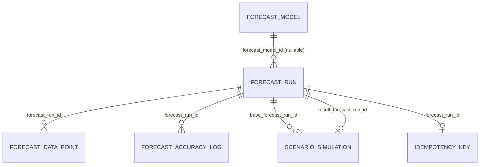

# AGNO WFM — Module 03: Forecasting Engine (Python)

**Phase 8 of 8 (final): TFT Tier (GPU-Gated), Explainability/Provenance API,
Observability + Hardening.** See `../docs/module-03-phase-1-design-doc.md` /
`-phase-2-design-doc.md` / `-phase-3-design-doc.md` / `-phase-4-design-doc.md`
/ `-phase-5-design-doc.md` / `-phase-6-design-doc.md` / `-phase-7-design-doc.md`
/ `-phase-8-design-doc.md` and `../docs/adr/0016`-`0026` for the reasoning
behind every non-obvious choice below (SQLAlchemy/Alembic split, the
shared-database-new-schema-new-role decision, RANGE-by-time partitioning,
the concrete `DataQualityCheck` thresholds/cold-start defaults, Phase 2's
three local tables, Phase 3's training/inference architecture, Phase 4's
LightGBM scope + promotion margin, Phase 5's Erlang C scope + AHT/shrinkage
fallback chains, Phase 6's scenario-simulation scope, Phase 7's
accuracy-logging trigger + staleness definitions + Prophet-only holiday
wiring, and Phase 8's TFT/GPU-gating + provenance + observability
decisions). This is the first Python service in the platform — see the
Phase 1 design doc's Problem section for why it isn't forced into
Module 01/02's NestJS/TypeORM mold.

## What's in this phase

**Phase 1** (schema & job scaffolding):
- Full DDL for every §2 entity (`ForecastModel`, `ForecastRun`,
  `ForecastDataPoint`, `SpecialEvent`, `ForecastAccuracyLog`,
  `ScenarioSimulation`) plus `DataQualityCheck` (§2.2) and
  `ForecastRun.is_cold_start` (§2.3) built in from day one, and
  `idempotency_keys` for §3.3's `Idempotency-Key` requirement —
  `migrations/versions/0001_initial_schema.py`.
- Row Level Security on every table, reusing Module 01's exact
  `app.current_tenant_id` GUC convention (ADR-0002/0017) — not a parallel
  isolation mechanism.
- A new `forecasting` Postgres schema and `agno_forecasting_app` role in the
  same `agno_wfm` database (`scripts/init-roles.sql`, root of the repo).
- `forecast_data_points`/`forecast_accuracy_log` partitioned `RANGE` monthly
  (ADR-0018); every other table unpartitioned.
- `POST /v1/forecasting/jobs` / `GET /v1/forecasting/jobs/{jobId}` (§3.3),
  idempotency-key handling, `X-Request-Id`, the `{ error: { code, message,
  details } }` envelope (reused from ADR-0015).
- A NATS JetStream publisher skeleton (`app/events/nats_publisher.py`) —
  connection + idempotent stream bootstrap are real and tested; nothing calls
  `publish_run_completed` yet since no model training exists to complete a
  run (Phase 3+).

**Phase 2** (data quality gate + cold-start fallback, ADR-0020):
- `historical_actuals`/`tenant_settings`/`queue_profiles` tables
  (`migrations/versions/0002_phase2_gate_and_cold_start.py`) — the storage
  the gate/cold-start logic needs that §2's own entity list never named.
- `DataQualityCheck` gate logic (`app/services/data_quality_service.py`),
  implementing ADR-0019's per-model-type thresholds for real.
- Cold-start similarity matching + forecast seeding
  (`app/services/cold_start_service.py`), same-tenant only.
- `POST /v1/forecasting/jobs` now evaluates the gate before creating a run:
  passes → normal `queued` run; fails with donors available → `is_cold_start:
  true`, seeded immediately, `status: completed`; fails with no donors →
  `422 INSUFFICIENT_DATA`, no run created.
- `POST /v1/forecasting/actuals`, `PUT
  /v1/forecasting/queue-profiles/{orgUnitId}`, `GET
  /v1/forecasting/data-quality/{orgUnitId}`.

**Phase 3** (SARIMA + Prophet training/inference, ADR-0021):
- Real model fitting + backtesting (`app/ml/sarima.py`,
  `app/ml/prophet_model.py`, `app/ml/backtest.py`) — defined MAPE/WFA
  methodology (§0), real confidence intervals.
- Ray-orchestrated parallel training dispatch
  (`app/services/ray_orchestrator.py`) and MLflow artifact logging/loading
  (`app/services/mlflow_registry.py`) — both imported lazily, never at
  module top level (ADR-0021, Decision 5).
- `POST /v1/forecasting/models/{orgUnitId}/retrain` (synchronous — §0.5's
  own ~2-minute SLO for a single SARIMA/Prophet run, not the fast
  job-submission-ack path) and `GET /v1/forecasting/models/{orgUnitId}`.
- Phase 3's promotion rule was naive (lowest `backtest_mape` among a single
  retrain call's candidates wins, full stop) — superseded in Phase 4, see
  below.
- `POST /v1/forecasting/jobs` fulfills a gate-passed run synchronously
  if an `active` model already exists for that org unit (real inference,
  not a stub) — and finally calls the real
  `nats_publisher.publish_run_completed` on every completion this endpoint
  produces (cold-start or model-fulfilled).

**Phase 4** (LightGBM & quality-gated promotion, ADR-0022):
- LightGBM as a third candidate model type (`app/ml/lightgbm_model.py`) —
  calendar features only (`day_of_week`/`hour`/`minute_of_day`/`is_weekend`
  derived from `interval_start`, no lag/external features), confidence
  intervals via quantile regression (three `Booster`s per candidate).
- The real quality-gated promotion mechanism §0.5 requires:
  `training_service.decide_promotion_winner` (pure function) only lets a
  fresh candidate become `active` if no active model exists yet, or it
  beats the *currently active* model's stored `backtest_mape` by ≥5%
  relative — not just "better than this batch's other candidates." A
  trained-but-not-promoted candidate gets
  `reason: "did_not_meet_promotion_margin"` in the API response.
- `POST /v1/forecasting/models/{orgUnitId}/retrain` now evaluates all three
  model types; the currently active model is left completely untouched
  when nothing clears the margin.

**Phase 5** (Erlang C headcount conversion, ADR-0023):
- Real, numerically stable Erlang C (`app/ml/erlang.py`) — cross-checked
  against an independent log-space reference implementation of the
  textbook formula, not just self-consistency.
- `forecasting.service_level_targets` table +
  `GET`/`PUT /v1/forecasting/service-level-targets/{orgUnitId}` — platform
  defaults (80% service level / 20s / 85% max occupancy) apply when
  unconfigured.
- `app/services/headcount_service.py` resolves AHT/shrinkage fallback
  chains once per run (not once per interval): a data point's own
  `predicted_aht_seconds`/`predicted_shrinkage_pct` win when populated
  (cold-start only), otherwise an 8-week historical average, and — for
  shrinkage only — a stated 30% platform default as the last resort. AHT
  has no such default: a queue with no AHT history anywhere gets
  `required_headcount: null` rather than a guess.
- Wired into both `inference_service.run_inference` and
  `cold_start_service.seed_cold_start_forecast` — `required_headcount` is
  now real and populated, closing the one `ForecastDataPoint` column every
  prior phase always left `NULL`.

**Phase 6** (scenario simulation, ADR-0024):
- `POST`/`GET /v1/forecasting/scenarios` — a scenario adjusts an existing
  base run's `ForecastDataPoint` rows arithmetically (`volumeMultiplier`
  multiplicative, `ahtDeltaSeconds`/`shrinkageDeltaPct` additive), producing
  a genuine new `ForecastRun` — no Ray, no MLflow, completes synchronously.
- AHT/shrinkage are resolved (own value or Phase 5's historical fallback)
  *before* the override delta applies, and the resolved-and-adjusted number
  is stored — a scenario's whole point is showing what was assumed, not
  hiding it behind `NULL` the way a model-fulfilled base run's own columns
  do.
- `required_headcount` recomputed via the same `headcount_service` Phase 5
  built; confidence bounds scale with `volumeMultiplier` (a stated
  heuristic — no model fit exists for the hypothetical to ask a real
  interval from).
- The result run publishes the same `agno.forecasting.run.completed.v1`
  event a live forecast completion does.

**Phase 7** (accuracy tracking + retraining triggers, ADR-0025):
- `POST /v1/forecasting/actuals` now also auto-logs `ForecastAccuracyLog`
  rows (`app/services/accuracy_service.py`) for every newly-ingested
  interval that has a matching prediction from a `completed` `ForecastRun` —
  no scheduler, triggered by the ingestion call itself, idempotent per
  `(forecast_run_id, interval)`. Response gained `accuracyLogged: int`.
- `GET /v1/forecasting/models/{orgUnitId}/staleness` — two independently
  reported signals (age-stale: active model >48h old; accuracy-degraded:
  recent mean MAPE >50% relative over the active model's own
  `backtest_mape`, once ≥10 samples exist) plus a combined
  `retrainRecommended` — a read-only signal, never triggers a retrain
  itself (call `/retrain` yourself, per ADR-0025 Decision 4).
- `GET /v1/forecasting/accuracy/{orgUnitId}` — the accuracy trend as a real
  time series (`evaluatedAt` is the scored interval, not wall-clock
  ingestion time).
- `POST`/`GET /v1/forecasting/special-events` — tenant- or
  org-unit-scoped calendar tagging (`app/services/special_event_service.py`),
  RLS-isolated, tenant-wide events visible from any org unit's listing.
- `training_service.retrain` feeds `event_type='holiday'` `SpecialEvent`
  rows into Prophet's native `holidays` mechanism for the `prophet`
  candidate only — a real, named, asymmetric gap: SARIMA/LightGBM don't
  consume this signal yet.

**Phase 8** (TFT tier + explainability/provenance API + observability +
hardening, ADR-0026 — the final phase):
- A real, opt-in `tft` model type (`app/ml/tft.py`, `pytorch-forecasting`) —
  verified for real against synthetic data in this sandbox (CPU wheel,
  no GPU present here), including a genuine multi-chunk rolling forecast
  past the model's trained horizon and a pickle/unpickle round trip. Never
  attempted unless explicitly requested (`RetrainRequest.modelTypes`) —
  never bundled into the default sarima/prophet/lightgbm trio.
- `tft` entitlement (`TenantSettings.tft_entitled`) is a hard
  `403 TFT_ENTITLEMENT_MISSING`, checked *before* the data-quality gate —
  `PUT /v1/forecasting/admin/tenant-settings` (platform-admin-gated) is
  this table's first real write path, closing ADR-0020 Gap 2.
- GPU dispatch is a Ray `num_gpus` resource request (`TFT_NUM_GPUS`,
  default `0`, CPU-scheduled unless a real GPU deployment opts in).
- `GET /v1/forecasting/models/{orgUnitId}/provenance` — the REST audit
  trail §3.2's `forecastModelProvenance` never had a home in this repo
  (Phase 1 pushed the GraphQL version to Node/Module 01). Every
  `ForecastModel` ever trained, newest first, plus real `lightgbm`-only
  feature importances — a named, asymmetric gap for the other three model
  types.
- `/healthz`+`/readyz` (real Postgres/NATS checks, replacing the old bare
  `/health`) and `/metrics` (`prometheus-client`), mirroring Module 01's
  liveness/readiness split and `prom-client` conventions. Structured JSON
  request logging — a first cut for the platform.
- A new, separate `forecasting-service` job in `.github/workflows/ci.yml` —
  this service had zero CI coverage across Phases 1-7.

## Entity relationships



`DataQualityCheck`, `SpecialEvent`, `HistoricalActual`, `TenantSettings`,
and `QueueProfile` are standalone (org-unit- or tenant-scoped, not FK'd to
`ForecastRun`) — see §2 of the module prompt and ADR-0020 for the last three.
`ForecastAccuracyLog` *does* have a real FK to `forecast_runs`
(`fk_forecast_accuracy_log_tenant_run`, enforced since migration 0001) even
though it wasn't populated by anything until Phase 7 — a hand-inserted row
needs a real `ForecastRun` id, not an arbitrary UUID (caught by an
integration test during this phase, see the Phase 7 readiness checklist).
`TenantSettings` gained its first real write path in Phase 8
(`PUT /v1/forecasting/admin/tenant-settings`, migration 0004) — still
`SELECT`-only for everything except `tft_entitled`/
`cold_start_cross_tenant_matching_enabled`, and still not reconciled with
a real billing/entitlement system.

## Getting started

```bash
# From the repo root - shared docker-compose with Module 01/02, now also
# running NATS JetStream for this module.
docker-compose up -d
cp forecasting-service/.env.example forecasting-service/.env

cd forecasting-service
python -m venv .venv && .venv/Scripts/activate   # source .venv/bin/activate on macOS/Linux
pip install -e ".[dev]"                          # needs Python 3.11/3.12 - see note below

alembic upgrade head        # applies migrations/versions, connects as agno_migrator
ruff check .                 # lint
mypy app                     # typecheck
pytest tests/unit            # unit tests, no DB/NATS required (does need ray/mlflow - see below)
pytest tests/integration     # requires docker-compose up + migrations applied
uvicorn app.main:app --reload --port 8000
```

**Python version**: this project pins `numpy<2.0`/`ray<3.0` etc. for a
Python 3.11/3.12 target — use one of those two locally. `ray` has no wheel
at all for Python 3.14, and `mlflow`'s `pyarrow` dependency needs a C++
toolchain to build from source on 3.14, so neither installs there — an
ecosystem-lag issue with a very new Python version, not something this
project's version pins can route around. Phase 3 was first built in a
Python 3.14 sandbox (verified everything except Ray/MLflow themselves by
static review + `sys.modules`-fake tests) and then re-verified for real once
Python 3.12 became available — that pass caught and fixed a genuine bug
(Ray's zero-copy object store crashing on a fitted SARIMA model's internal
Cython state, ADR-0021 Decision 6) that the fakes couldn't have surfaced.
See the Phase 3 production readiness checklist for the full story. Phase 8's
`torch`/`pytorch-forecasting`/`lightning` (CPU wheels) install and run for
real on Python 3.12 in this same environment — no equivalent gap this time.

**GPU**: `tft` training runs on CPU by default (`TFT_NUM_GPUS=0`) - this
project has never had access to real GPU hardware to test the
`num_gpus>0` Ray dispatch path against (ADR-0026, Decision 4), stated
honestly rather than assumed to work.

**Testing against an existing/shared Postgres instead of `docker-compose`'s
local one**: point `.env`'s `DB_HOST`/`DB_PORT`/`DB_DATABASE` at it and, as
the instance's superuser (or an existing `agno_migrator`-equivalent), run
just the `agno_forecasting_app` role + `forecasting` schema block from
`scripts/init-roles.sql` (skip `agno_migrator`/`agno_app`/`core`/`org` if
Module 01/02 already provisioned those - the whole file is written to be
additive/idempotent-by-inspection, not "run everything or nothing"). Then
`alembic upgrade head` as normal. This is exactly how this module's full
pipeline was actually verified end-to-end (a real shared Postgres, a real
local NATS+JetStream, real Ray, real MLflow, real SARIMA/Prophet/LightGBM),
not just unit-tested, every phase since Phase 3 - a pass that caught and
fixed four real bugs in Phase 3 (a Ray zero-copy-buffer crash on fitted
SARIMA state, a test-fixture event-loop mismatch, a >32,767-bind-parameter
INSERT once a large-enough actuals backfill is submitted in one call, and a
missing `UPDATE` grant `ON CONFLICT DO UPDATE` needs) and none since (Phases
4-6 each built cleanly on that already-verified foundation). See the Phase
3-6 production readiness checklists for the full story.

## Cross-module addition: `ForecastService` gRPC surface (Module 04 Phase 6)

Not part of this module's own eight planned phases (those are complete, see
the header above) — added when Module 04's own Phase 6 needed a real
`GetForecastRequirements` RPC to pull coverage requirements from and none
existed. `app/grpc/proto/forecast.proto` (package `agno.forecasting.v1`),
served by `app/grpc/forecast_grpc_server.py` (`grpc.aio`), booted alongside
the HTTP app in `app/main.py`'s `lifespan` on `GRPC_URL` (default
`0.0.0.0:6000`, mirroring Module 01/02's own `GRPC_URL` convention on a
different port). Reads `ForecastDataPoint.required_headcount` (already
computed by Phase 5's Erlang C pipeline) for a given `forecast_run_id` — a
read, not new computation. See `../docs/adr/0059-phase-6-grpc-data-pull-architecture.md`
and `../docs/module-04-phase-6-design-doc.md` for the full reasoning
(including why this is unary, not server-streaming like `EmployeeService`).

**A real bug found and fixed while adding this**: `migrations/env.py` never
scoped Alembic's own revision-tracking table into this service's `forecasting`
schema (Module 04's own `scheduling-service/migrations/env.py` already
carries a comment flagging exactly this collision risk for "a future Module
05 or later" — this service predates that comment and never picked up the
fix). Running this service's migrations against the same shared Postgres
Module 04 uses read *Module 04's own* `scheduling.alembic_version` row
(both services' migrations happen to number revisions `0001`-`0004` too) and
nearly advanced this service's tracking state into that table instead of a
home of its own. Fixed with `version_table_schema="forecasting"`, the same
fix Module 04's own file already applies to itself.

**Verifying this new surface**: because `app/main.py` transitively imports
this service's full ML stack (`torch`/`ray`/`mlflow`/`lightgbm`/`prophet`/
`pytorch-forecasting`/`lightning`) just by importing the existing job/model
routers, the new gRPC server was verified *in isolation* — a real
`grpc.aio.Server` bound to a real socket, a real `grpc.aio` client, a real
Postgres — via `tests/grpc/` (deliberately outside `tests/integration/`,
whose own `conftest.py` imports `app.ml.training` and would pull in that
same heavy ML stack for a test that doesn't need any of it). `run_grpc_server_standalone.py` (repo root of this service) is that
standalone runner - the same server construction `app/main.py`'s own
`lifespan` boots, minus the FastAPI app around it - and is what Module 04's
own Phase 6 integration tests connected to for their real, cross-service
proof.

## Cross-module addition: `ForecastExplanationDataService` gRPC surface (Module 10 Phase 4)

Also not part of this module's own eight planned phases — added when
Module 10's (AI Layer) own Phase 4 needed `explainForecast(forecastRunId)`'s
data source and found the same shape of gap `ForecastService` itself once
filled for Module 04: no existing call answered "for this forecast run,
what model produced it and how accurate has it been." `app/grpc/proto/forecast_explanation_data.proto`
(same package, `agno.forecasting.v1`), served by `app/grpc/forecast_explanation_data_grpc_server.py`
— this service's *second* gRPC servicer, registered alongside `ForecastService`
in the same `app/main.py` `lifespan`, same port. Joins `ForecastRun` →
`ForecastModel` (via the nullable `forecast_model_id` FK) → `ForecastAccuracyLog`
(by `forecast_run_id`) — a plain read, no new computation, same posture as
`ForecastService` itself. See `../docs/adr/0119-forecast-explanation-data-grpc-surface-added-to-forecasting-service.md`.

**Verified more thoroughly than `ForecastService` originally was**: `tests/grpc/test_forecast_explanation_data_grpc_server.py`,
4/4 passing against a real, running Postgres over a real gRPC socket
(found-with-model, found-without-a-linked-model, not-found, wrong-tenant) —
this environment happened to have `grpcio`/`grpcio-tools`/`SQLAlchemy`
installed without the full ML stack, so this new test file (like
`test_forecast_grpc_server.py` before it) ran for real, not merely
type-checked.

## Scripts (no `package.json` here — direct commands)

| What | Command |
|---|---|
| Apply / roll back migrations | `alembic upgrade head` / `alembic downgrade -1` |
| Lint | `ruff check .` |
| Typecheck | `mypy app` |
| Unit tests | `pytest tests/unit` |
| Integration tests | `pytest tests/integration` (needs Postgres + NATS up, migrations applied) |
| Run the service | `uvicorn app.main:app --reload --port 8000` |

## Why there's a running FastAPI app with real routes (unlike Module 01/02's Phase 1)

Module 01/02 both booted a routeless skeleton in Phase 1 and deferred their
HTTP surface to later phases. Module 03 doesn't have that luxury: the source
spec names "job scaffolding" as explicit Phase 1 scope (§7), and async job
submission (§3.1) is the load-bearing contract everything else in this module
hangs off of. `POST /v1/forecasting/jobs` creates a real, persisted
`ForecastRun` row, and (as of Phase 3) reaches a terminal state in three of
its four possible outcomes: cold-start-seeded (Phase 2), model-fulfilled via
real SARIMA/Prophet inference (Phase 3, when an active model already
exists), or rejected outright (`422 INSUFFICIENT_DATA`). Only the fourth -
gate passes, no active model exists yet - still leaves a run sitting at
`status: queued` indefinitely, because nothing auto-triggers training inline
(that would violate the submission SLO - see ADR-0021, Decision 2; call
`/retrain` first). Every other branch is real and exercised by
`tests/integration/test_jobs_api.py`/`test_models_api.py`, not a stub
standing in for later work.

## Capacity planning (provisional — §0.5)

No load test exists yet (see `../docs/production-readiness-checklist.md`'s
sibling for this module, once Phase 6+ gives this service real traffic to
point a load test at). Sizing assumptions only:

- **`forecast_data_points` write volume**: one row per interval per
  `ForecastRun`. At 30-minute intervals, a 30-day forecast run for one org
  unit is 1,440 rows; a tenant with hundreds of queues re-running forecasts
  regularly is the reason ADR-0018 chose time-based partitioning over
  tenant-based — this table's growth is fundamentally unbounded by tenant
  count in a way `Employee` (Module 02, ADR-0010) isn't.
- **Ray/GPU compute budget per tenant tier**: Phase 8 adds the GPU/TFT
  entitlement gate (`tft` is 403'd without `TenantSettings.tft_entitled`)
  and a `TFT_NUM_GPUS` resource-request knob, but there's still no
  per-tenant *rate/cost ceiling* — an entitled tenant can call `/retrain`
  with `tft` for every org unit it has with no limit. §0.5's "state the
  cost model explicitly" ask is now partially answered (entitlement gates
  *access*) but not the remaining rate/cost-ceiling question.
- **Training/inference are CPU-bound, dispatched via `asyncio.to_thread`**
  so they don't block the event loop for other concurrent requests — not
  load-tested (see the Phase 3 production readiness checklist).
- **Connection pooling**: `app/db/session.py` creates one `AsyncEngine` per
  process with `pool_pre_ping=True`; no PgBouncer modeled in
  `docker-compose.yml`, same local-dev-only posture Module 01/02 already
  documented for their own Phase 1.

## Testing strategy for this phase

- **Unit** (`tests/unit/`): `TenantContext` fail-closed + `contextvars`
  isolation across concurrent async tasks (the Python analogue of
  `AsyncLocalStorage` isolation), the error envelope shape,
  `TenantContextMiddleware`/`RequestIdMiddleware` behavior on a minimal app
  (no DB, no NATS), Phase 2's pure logic (ADR-0019's threshold rules,
  cold-start similarity scoring/bucketing/averaging), Phase 3/4's backtest
  math (`test_backtest.py` — MAPE/WFA hand-verified against manually
  computed values), Phase 4's promotion-margin logic (`test_promotion.py` —
  pure, no DB), Phase 5's Erlang C math (`test_erlang.py` — cross-checked
  against an independent log-space reference implementation of the
  textbook formula) and headcount fallback-chain logic
  (`test_headcount_service.py` — pure, no DB), Phase 6's scenario-override
  math (`test_scenario.py` — pure, no DB), Phase 7's per-interval MAPE/bias
  math (`test_accuracy.py` — pure, zero-actual guard included) and
  `build_holidays_frame`'s window computation plus a real Prophet fit
  against a holidays frame (`test_ml_models.py`), Phase 8's real
  `pytorch-forecasting` TFT fit/forecast (`test_tft.py` — beats a naive
  baseline, confidence-interval consistency, a genuine multi-chunk rolling
  forecast past the model's trained horizon, a pickle/unpickle round trip,
  insufficient-data rejection), **real** SARIMA/Prophet/LightGBM/TFT
  fit-and-forecast against synthetic data (`test_ml_models.py`/`test_tft.py`
  — genuine `statsmodels`/`prophet`/`lightgbm`/`pytorch-forecasting` calls,
  not mocked), and **real Ray + real MLflow**
  (`test_ray_orchestrator_smoke.py` — a real local Ray cluster training all
  three model types in parallel, real per-candidate failure isolation, and a
  real MLflow log/load round-trip for each model type against a `file:`-
  backed tracking store in a temp dir). 123 tests, requires `ray`/`mlflow`/
  `lightgbm`/`torch`/`pytorch-forecasting` installed (core dependencies,
  Python 3.11/3.12 only), not a database.
- **Integration** (`tests/integration/`): against a real Postgres with all
  four migrations applied — tenant isolation at both layers, all `POST
  /v1/forecasting/jobs` outcomes (queued / cold-start-completed /
  `422 INSUFFICIENT_DATA` / model-fulfilled-completed, each now also
  asserting `required_headcount` is populated), the quality-gated promotion
  rule (including the "trained but margin not cleared, active model left
  untouched" case, ADR-0022), per-candidate training-failure isolation, the
  full `/retrain` + `GET /models` HTTP contract,
  `service-level-targets`' default/override/tenant-isolation behavior,
  Phase 6's full scenario flow (volume-multiplier scaling verified against
  real stored data points, missing/empty/cross-tenant base run rejections),
  and Phase 7's accuracy auto-logging (idempotency, no-op on non-matching
  intervals, RLS on the trend endpoint), staleness's three states (no
  active model, insufficient accuracy data, age/accuracy degraded) plus a
  non-mutation check, and special-event create/list/RLS/validation. Phase
  8 adds admin `tenant_settings` upsert + platform-admin gating, `tft`
  entitlement's 403-before-the-gate ordering (including with zero data
  seeded, proving the check never reaches the gate), an entitled tenant
  actually training `tft`, the provenance endpoint's full history
  ordering + real `lightgbm` feature importances (via a fake that fits a
  genuine booster, not a mock) + the no-importances-for-other-types case +
  cross-tenant RLS, and `/healthz`/`/readyz`/`/metrics`.
  `ray_orchestrator`/`mlflow_registry` are faked via a `sys.modules`
  injection fixture (`fake_ml_backends`, `conftest.py`) here — not because
  Ray/MLflow can't run (they do, for real, in the unit suite above and in
  end-to-end verification runs — see the Phase 3-8 production readiness
  checklists), but to keep these DB-dependent tests fast and deterministic.
  The fake's `load_model` still fits a real (tiny) model per type so
  `inference_service`'s actual `.forecast()`/`.predict()` calls run for
  real, not mocked away. 180 tests total (123 unit + 57 integration) when run
  together against real Postgres/NATS.
- **Not done, this phase or any prior one** (the platform's real remaining
  gaps, not this module's alone): backtest-validation tests against a
  *known, fixed* synthetic dataset with an asserted accuracy bound in CI
  (§6 names this explicitly — `test_ml_models.py`'s "beats a naive
  baseline" tests are a weaker, directional version of this, not the full
  ask), load tests (see Capacity planning above), contract tests for the
  gRPC calls to Module 02's `EmployeeService`/`CalendarService` (not needed
  by anything built so far), cold-start seed/trained-model *quality*
  validation against real production accuracy data over time (Phase 7
  gives this service the accuracy data to validate against — no such
  longitudinal analysis exists yet), a true statistical-significance
  promotion test (Decision 3's 5% margin is a stated default), Erlang X/A
  (abandonment) support, per-interval scenario overrides, a scheduler that
  actually closes the staleness→retrain loop, TFT's native
  variable-selection-network explainability, SARIMA/Prophet
  explainability, rate limiting, and integration tests in CI - see the
  Phase 4-8 production readiness checklists, and the Phase 8 checklist
  specifically for the complete "explicitly not done here" list this
  module ends on.

## Documentation index

- `../docs/module-03-phase-1-design-doc.md` / `-phase-2-design-doc.md` /
  `-phase-3-design-doc.md` / `-phase-4-design-doc.md` / `-phase-5-design-doc.md`
  / `-phase-6-design-doc.md` / `-phase-7-design-doc.md` / `-phase-8-design-doc.md`
  — problem, options, decision, blast radius, rollback, explicit
  assumptions, per phase.
- `../docs/adr/0016`–`0026` — SQLAlchemy/Alembic choice, shared-database
  schema/role split, time-based partitioning, data-quality thresholds +
  cold-start defaults, Phase 2's three local tables + gate-discriminator
  decision, Phase 3's training/inference architecture, Phase 4's
  LightGBM scope + quality-gated promotion mechanism, Phase 5's Erlang C
  scope + `service_level_targets`/AHT/shrinkage fallback decisions, Phase
  6's scenario-simulation scope, Phase 7's accuracy-logging trigger +
  staleness definitions + Prophet-only holiday wiring, and Phase 8's TFT
  tier + GPU gating + entitlement-check ordering + provenance API +
  observability decisions.
- `../docs/module-03-phase-1-production-readiness-checklist.md` /
  `-phase-2-...` / `-phase-3-...` / `-phase-4-...` / `-phase-5-...` /
  `-phase-6-...` / `-phase-7-...` / `-phase-8-...` (repo-root `docs/`, not
  here) — what's done vs. genuinely out-of-scope infra/process work, per
  phase. Phase 8 is the last of the eight planned phases; its checklist's
  "Explicitly NOT done here" section is this module's complete list of
  real, named, still-open gaps as of the end of this build.
- `../docs/adr/0059-phase-6-grpc-data-pull-architecture.md` /
  `../docs/module-04-phase-6-design-doc.md` — the `ForecastService` gRPC
  addition above, driven by Module 04's Phase 6, not this module's own
  phase sequence.
- `../docs/adr/0119-forecast-explanation-data-grpc-surface-added-to-forecasting-service.md` /
  `../docs/module-10-phase-4-design-doc.md` — the `ForecastExplanationDataService`
  gRPC addition above, driven by Module 10's Phase 4.
